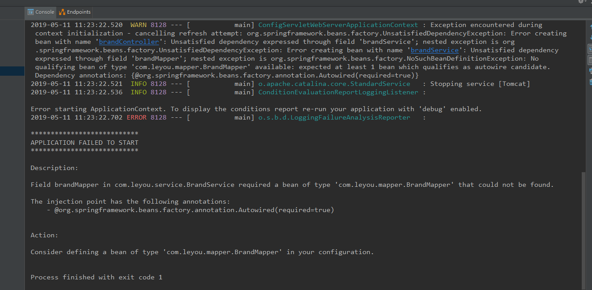
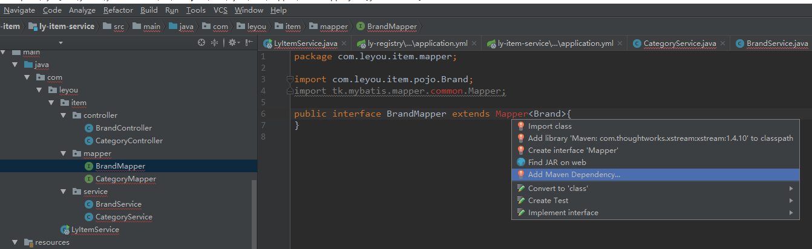
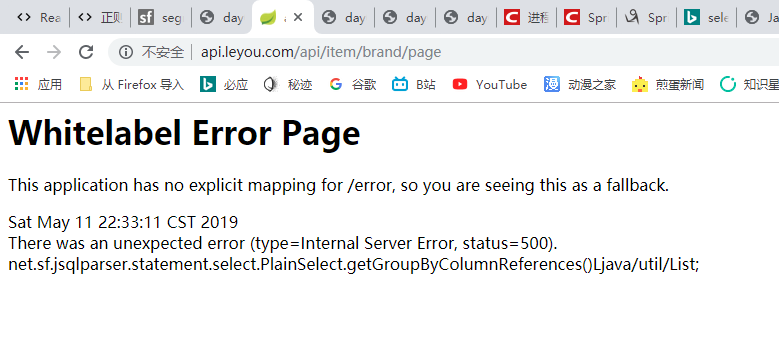
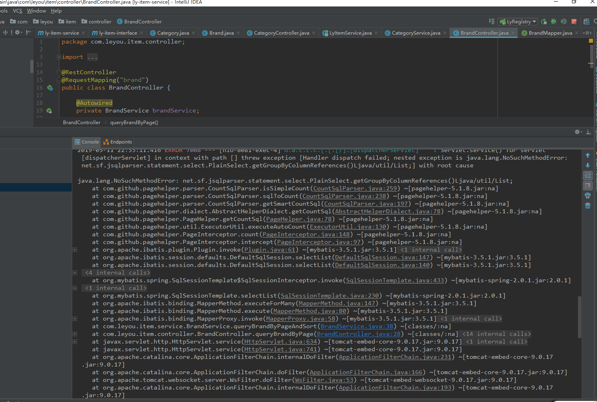
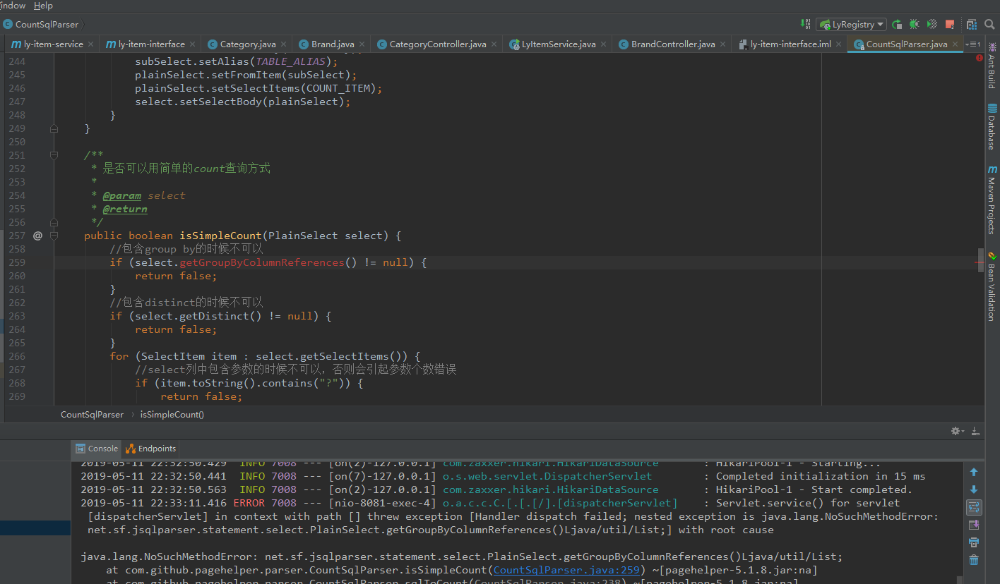
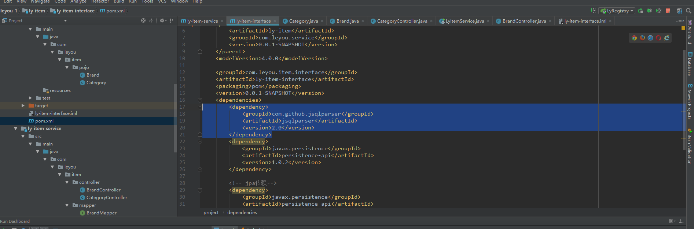
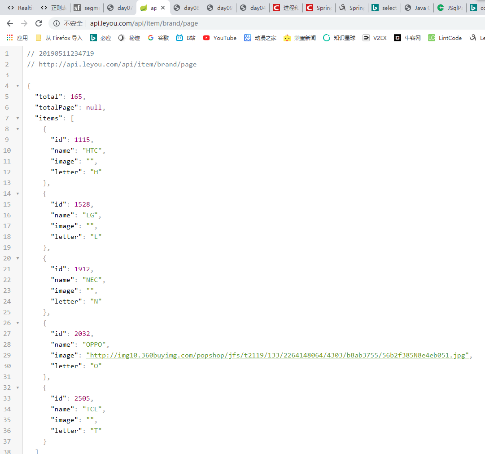
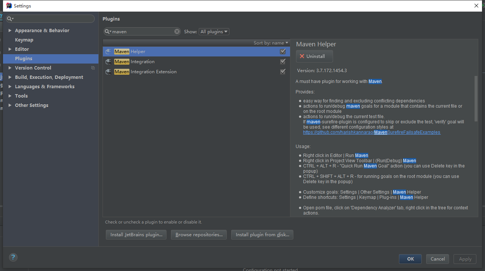
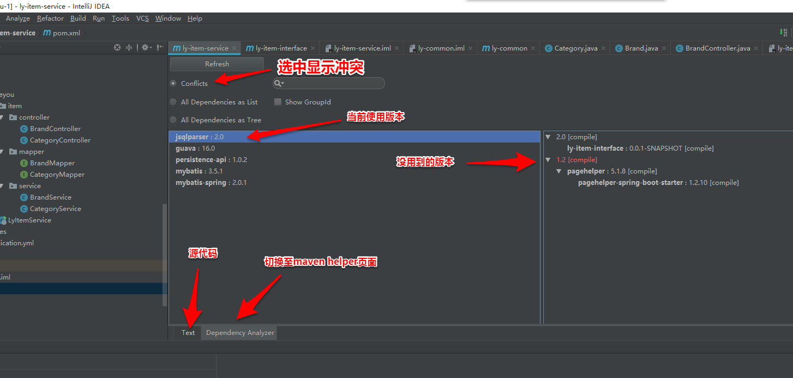
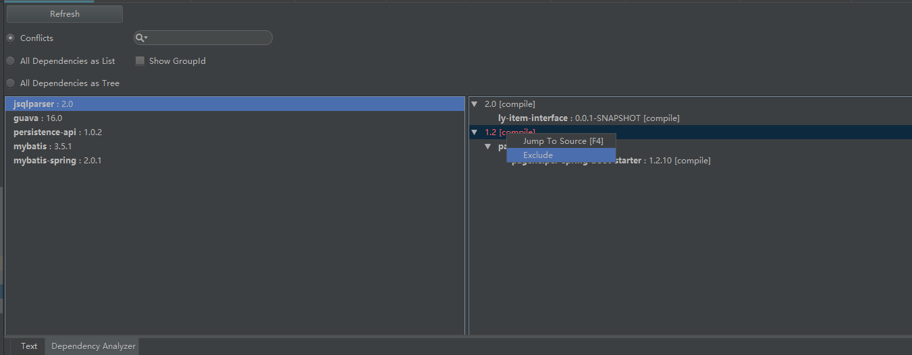

### 第一个BUG

首先是原初之罪的BUG，出现了找不到Bean的情况

中间是怎么解决的我忘记了，还引出一个新建的maven module没有配置`Sources Root`、`Test Sources Root`等相应文件夹，后面这个通过`Project Structure`的Modules设置和Module自身的`.imi`文件设置就能解决

### 第二个BUG

解决了这些后，又TM引出了一个BUG

无论都导入不了`tk.mybatis.mapper.common.Mapper`包

搞了半天都没处理好的我，毅然决然地使用了暴力破除法，直接重建一个项目，再将这个项目的东西搬过去，然后就好了……

本以为这样终于结束了，因为到这里已经花掉我半天时间了

——但！是！

### 第三个BUG

这里又双叒叕冒出来一个BUG了

查看了下出错的源代码，很明显的`NoSuchMethodError`，找不到对应方法，源代码也是干脆利落地给出了红色标注我当场就懵了，总不会是源代码自己出错吧，没理由啊，肯定是自己太菜了，哪里弄错了才对

于是我又继续埋头苦干，边自己捣鼓，边去群里询问
期间从某个学习群的群友那里得到了一个可能是导错包了的原因，然后我想错了，以为是项目对于maven仓库包的引用导入有问题，需要更新下什么的，就把整个maven本地仓库删掉再重加载，再把项目的`Libraries`引用全删了再重新用`mvn compile`指令加载回来

然后不出意外的——问题并没有得到解决
（理所当然的，因为问题根本就不是出在那里）

最后发现是`pom.xml`配置文件里面的依赖冲突导致的，将其那段多余的冲突依赖删掉后就没事了

### 处理依赖冲突的maven helper插件

最后有个群友推荐了IDEA的一个专门处理maven依赖冲突的插件，`maven helper`，下载好了后重启，即可使用

重启后进入`pom.xml`配置文件内，可看到以下内容

使用时，右键可以将用不到的版本`Exclude`掉，不过要解决问题大多没那么简单直接`Exclude`就能完事的，相关教程什么的可以去网上找，这里就不多说了

