## 一.配置jdk1.8

 这个没啥好说的，直接输入指令安装 
```
yum -y install java-1.8.0-openjdk.x86_64
```

安装成功后会有Complete提示，并且可通过java -version查看当前版本

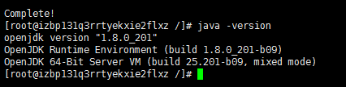

 
## 二.搭建tomcat8

 

 用xftp工具与服务器连接后，将下载好的tomcat压缩包丢到/usr/local/目录下，再使用Xshell工具，输入命令
 
```
tar -zxvf apache-tomcat-8.5.39.tar.gz 
```
 解压到当前目录，并将文件名改为tomcat8，之后就能将压缩包删了
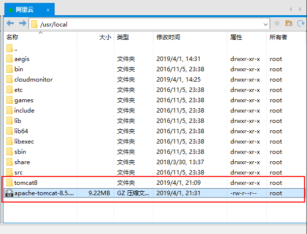

 阿里云服务器设置开放8080端口

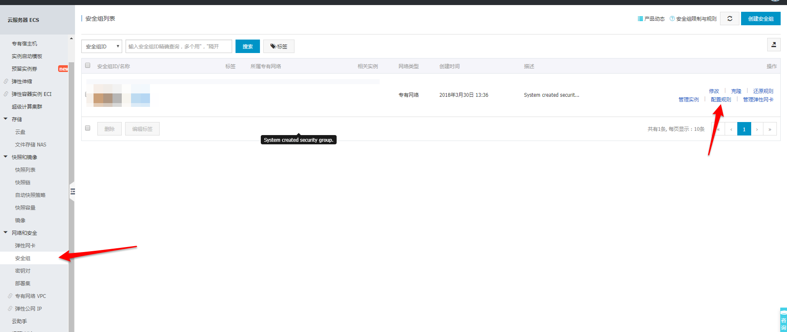

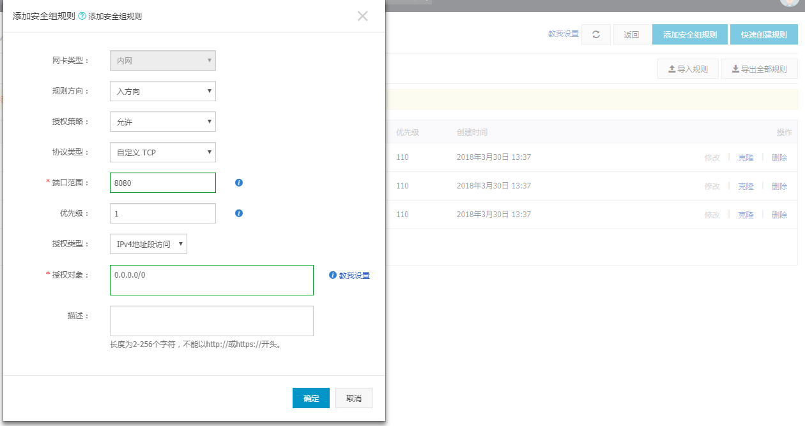

 防火墙开放8080端口
```
开放端口：firewall-cmd --zone-public --add-port=8080/tcp --permanent
重新加载：firewall-cmd --reload
```
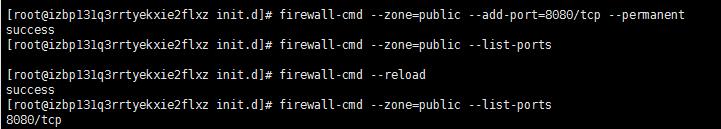

 启动tomcat测试
 
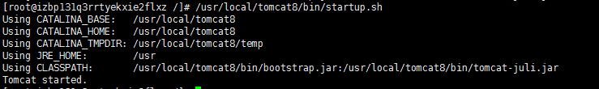

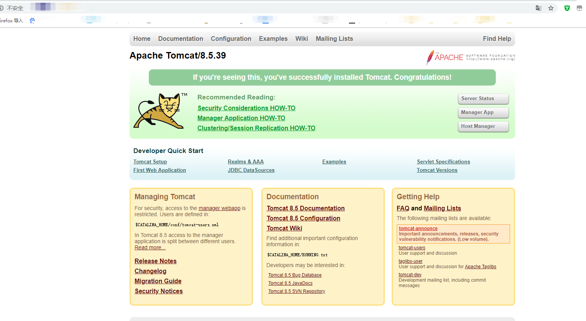

 提高阿里云服务器部署的tomcat外界访问速度，以下为原文地址

 [https://blog.csdn.net/qq_40386113/article/details/84837881](https://blog.csdn.net/qq_40386113/article/details/84837881)

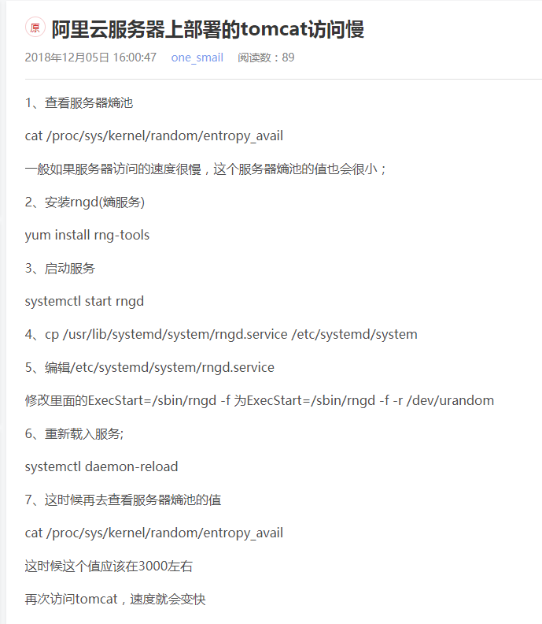
 
## 三.mysql安装配置

 执行命令, 安装mysql
```
 yum -y install mysql-community-server
```

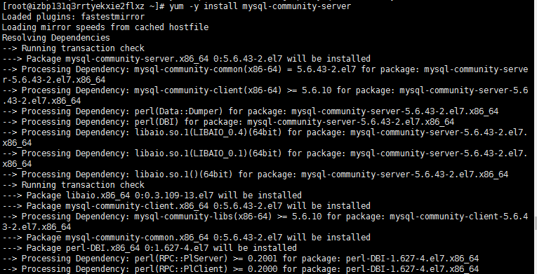

 检查是否安装成功

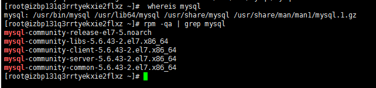


 设置开机自动启动mysql，使用以下两个命令
```
 systemctl enable mysqld
 systemctl list-unit-files | grep mysqld
```
 
 查看是否设置成功

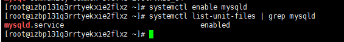

启动mysql服务，并查看mysql服务是否已启动
```
systemctl start mysqld
ps -ef|grep mysql
```
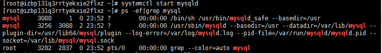

 进行mysql的用户名、密码等信息进行配置
 
```
mysql_secure_installation
```
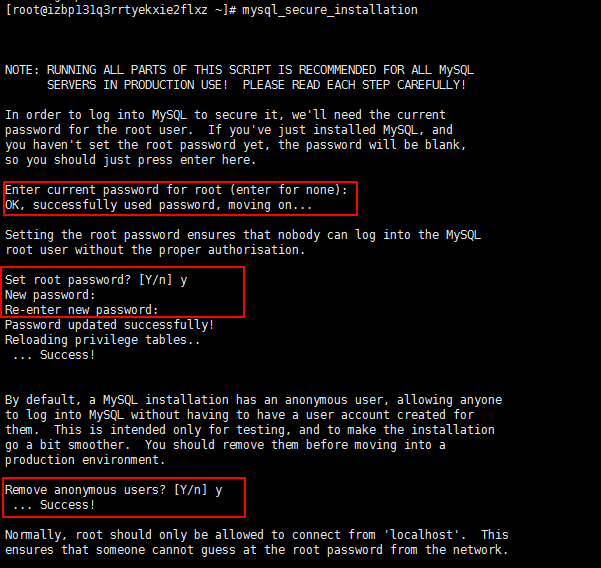

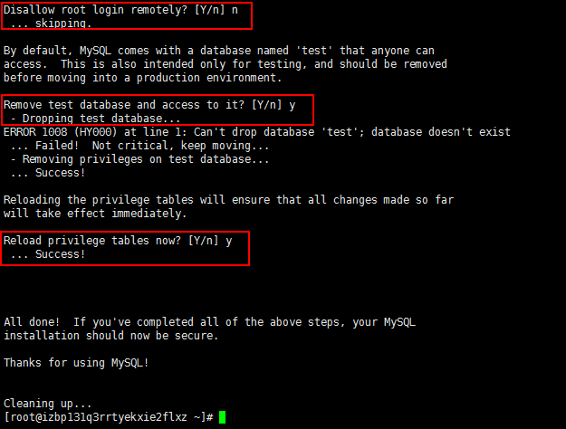

 启动mysql
 
```
mysql -uroot -p
```

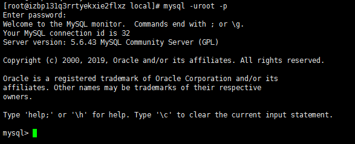

 防火墙开放3306端口
 
```
firewall-cmd --zone-public --add-port=3306/tcp --permanent
firewall-cmd --reload
```

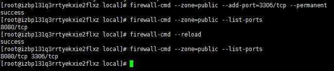


 配置远程登录

```
grant all privileges on *.* to 'root'@'%' identified by 'root' with grant option;
```

 （指令意为将所有权限赋予给 root 用户，并允许其进行远程登录）

 红框部分填写的是访问远程访问root用户所使用的密码

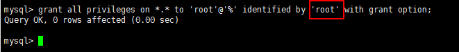

 最后，用其他机子测试连接成功
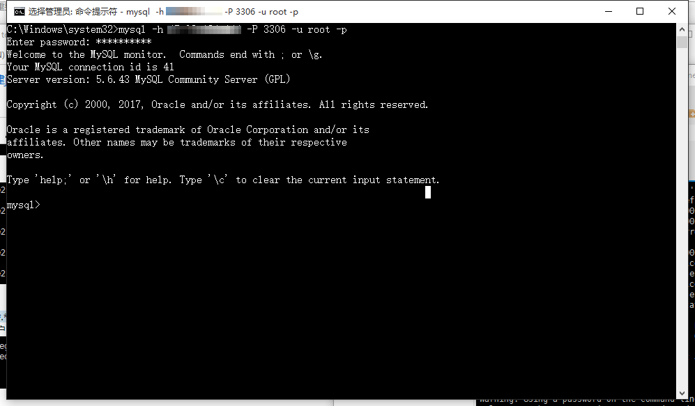

 

   
 