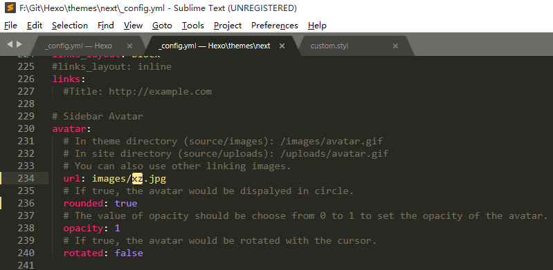
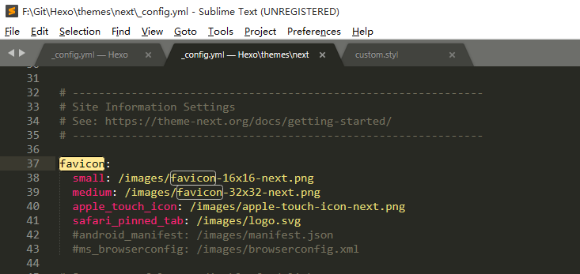
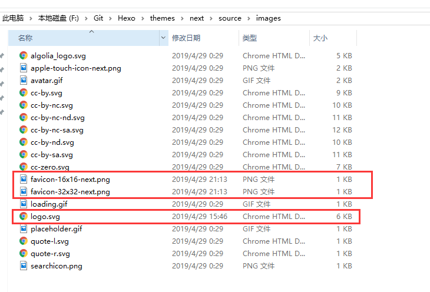
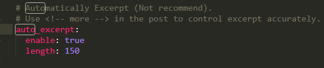
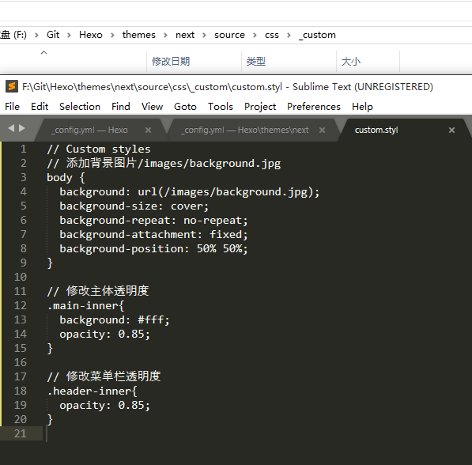
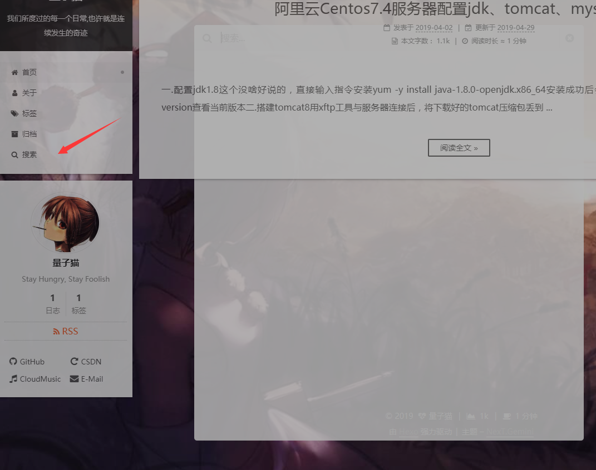
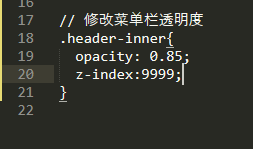
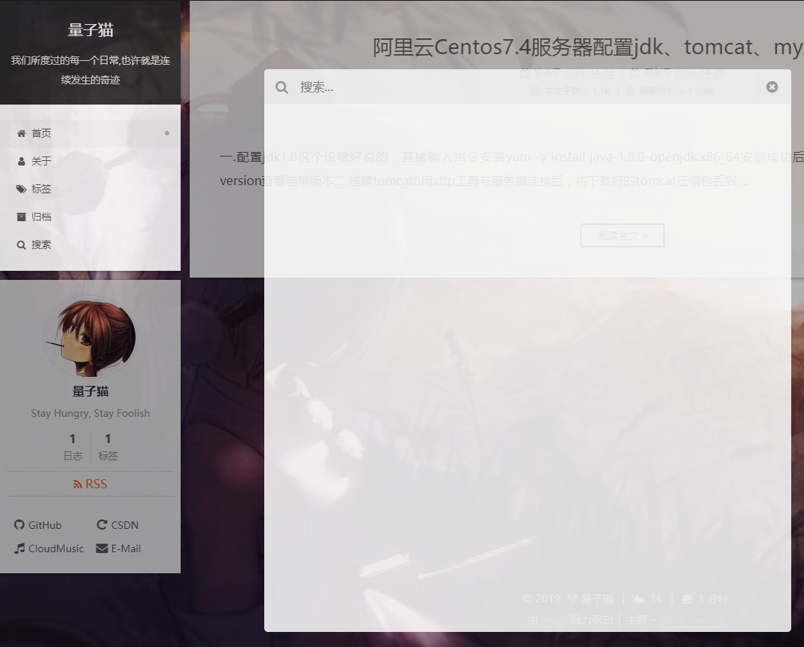
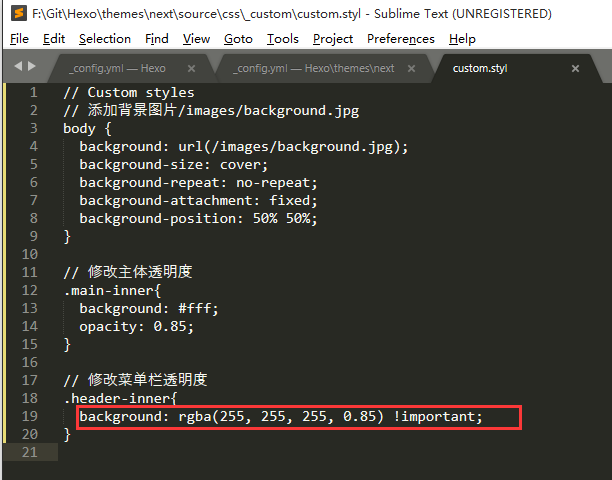
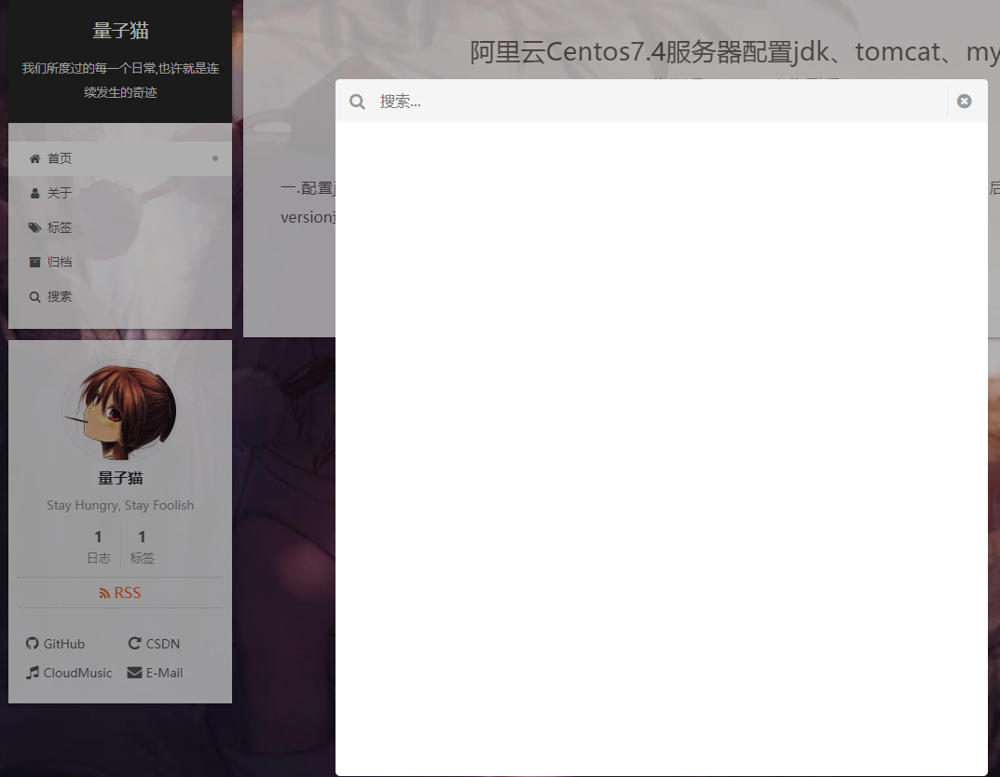

### 准备
下载[Next最新主题](https://github.com/theme-next/hexo-theme-next/releases)并将解压到themes目录下，旧版本的Next主题先保留着作个数据对照和参考，等到新版本完全配置完毕，再删了也不迟，下面我只简单说些我感受到的版本差异，还有一些美化优化设置

### 设置头像
我用5.1版本时，头像的设置要在hexo的主配置 `_config.yml` 文件下添加以下代码
```
avatar: 头像图片的url地址
```
新版本已经将头像设置的功能集合到Next主题的 `_config.yml` 配置文件中，我将头像图片放在hexo/source/imges中，配置如下图所示



### 设置网站logo

该功能同样集合在Next主题的 `_config.yml` 配置文件中，将分割好的网站logo文件替换掉Next主题的images文件夹下的logo文件，总共有三个文件要替换，注意大小跟格式要匹配


Next主题的 `_config.yml` 配置文件，搜关键词 `favicon` 即可找到对应网站logo设置



### 设置阅读全文

在个人博客中，倘若文章显示全文，那在首页就长得没法看后面的文章了，所以我们要给他设置个预览效果
在Next主题的`_config.yml`配置文件中，搜索 `auto_excerpt` 并将其唤醒，enable的参数为是否唤醒，length的参数则为展示的高度


### 设置搜索功能

1. 安装插件
    
```
npm install hexo-generator-searchdb --save
```
2. 设置hexo的主配置文件

   在文件中添加以下代码
```
# 本地搜索
search:
  path: search.xml
  field: post
  format: html
  limit: 10000
```
3. 设置Next主题的配置文件
    
    配置文件中有集成该搜索功能，搜索 `local_search` 并将其enble设置为true即可启动
    
```
local_search:
  enable: true
  trigger: auto
  top_n_per_article: 1
  unescape: false
```
### 设置背景图片以及界面透明化美化
    
修改Next主题下的source/css/_custom中的 `custom.styl` 文件，注意此处的背景图片是放在hexo根目录下的source/images/


    

不过用上述这种方法将透明度修改过后，会造成一个BUG——搜索框不再置顶，而是被其他模块挡住了


    
这个我折腾了半天，想出了个简单粗暴的方法，直接在设置透明度时给它来个z-index:9999的属性，虽说这样能解决问题，但解决BUG的代码是引出另外的、不怎么明显的BUG





从上图可以看出，菜单栏与搜索框一同置顶了，所以高亮的颜色跟周围有所不同，并且搜索框也被透明化了，让人观看时的体验不是很舒服

不过在这时，我不久前求助的群里，有个群友说他曾经也遇到过这个透明化问题，但他的解决方法是将菜单栏单独设置成白色透明的背景色，这样就能避免跟搜索框产生冲突，我去试了一下，这个方法能完美解决上述问题，同时不会让搜索框透明化





