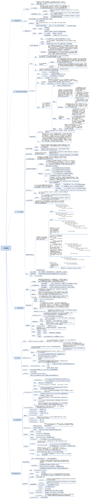

### 1、上下文切换

#### （1）时间片

​		即使是单核处理器也支持多线程执行代码，CPU通过给每个线程分配CPU时间片来实现这个机制。时间片是CPU分配给每个线程的时间，由于时间片非常短，所有CPU通过不停地切换线程执行，导致我们感觉多个线程是同时执行的，时间片一般是几十毫秒（ms）。

#### （2）上下文切换

​		CPU通过时间片分配算法来循环执行任务，当前任务执行一个时间片后就会切换到下一个任务。但是，CPU在切换前会保存上一个任务的状态，以便下次切换回该任务时能够从上次执行的位置继续执行下去。这个任务从保存到再次加载的过程就是一场上下文切换。

#### （3）减少上下文切换的方法

- 无锁并发编程：多线程竞争锁时，会引起上下文切换，所以多线程处理数据时，可以用一些办法来避免使用锁，例如将数据的ID按照Hash算法取模分段，不同线程处理不同段的数据。
- CAS算法：Java的Atomic包使用CAS算法来更新数据，不需要加锁。
- 使用最少线程：避免创建不需要的线程，比如任务很少但创建了大量线程来处理，这会导致大量线程都处于等待状态。
- 协程：在单线程里实现多任务的调度，并在单线程里维持多个任务间的切换。

### 2、死锁

#### （1）含义

​		当两个或两个以上的线程在执行过程中，因为竞争资源而造成的一种僵局，线程相互持有对方所需的资源又不释放，若无外力作用，它们都将无法推进下去。

#### （2）死锁产生的4个必要条件

1. 互斥：线程要求对所分配的资源进行排它性控制，即在一段时间内某资源仅为一线程所占用。
2. 占有和等待：当线程因请求资源而阻塞时，对已获得的资源保持不放。
3. 不可抢占：线程已获得的资源在未使用完之前，不能剥夺，只能在使用完时由自己释放。
4. 循环等待：在发生死锁时，必然存在一个线程--资源的环形链。

#### （3）避免死锁的方法

1. 资源一次性分配：一次性分配所有资源，这样就不会再有请求了（破坏请求条件）
2. 只要有一个资源得不到分配，也不给这个进程分配其他的资源（破坏请保持条件）
3. 可剥夺资源：即当某进程获得了部分资源，但得不到其它资源，则释放已占有的资源（破坏不可剥夺条件）
4. 资源有序分配法：系统给每类资源赋予一个编号，每一个进程按编号递增的顺序请求资源，释放则相反（破坏环路等待条件）

#### （4）Java避免死锁的常见方法

1. 避免一个线程同时获取多个锁。
2. 避免一个线程在锁内同时占用多个资源（例如ConcurrentHashMap的实现），尽量保证每个锁只占用一个资源
3. 尝试使用定时锁，使用lock.tryLock（timeout）来替代使用内部锁机制，一定时间内获取不到就返回。
4. 对于数据库锁，加锁和解锁必须在同一个数据库连接里，否则会出现解锁失败的情况。

### 3、资源限制

#### （1）含义

​		资源限制是指再进行并发编程时，程序的执行速度受限于计算机硬件资源或软件资源。例如，服务器的带宽只有2Mb/s，某个资源的下载速度是1Mb/s，即使系统启动10个线程下载资源，下载速度也不会编程10Mb/s。

#### （2）资源限制会引发的问题

​		在并发编程中，若受限于资源，将代码从串行执行的部分改成并发执行，不仅不会加快执行速度，反而会因为增加了上下文切换和资源调度的时间，变得更慢。

#### （3）软件资源

​		软件资源受限有数据库的连接数、socket连接数等等。

​		解决方法可以是考虑使用资源池将资源复用，例如使用连接池将数据库和socket连接复用，或者再调用对方webservice接口获取数据时，只建立一个连接。

#### （4）硬件资源

​		硬件资源受限有带宽的下载和上传速度、硬盘读写速度、CPU处理速度等等。

​		解决方法可以是考虑使用集群并发执行程序。既然单击资源有限，那就让程序在多机上运行，例如使用ODPS、Hadoop或者自己搭建服务器集群，不同机器处理不同的数据。

​		上图为《Java并发编程的艺术》的思维导图，图片出处：https://github.com/zaiyunduan123/java-concurrent-art