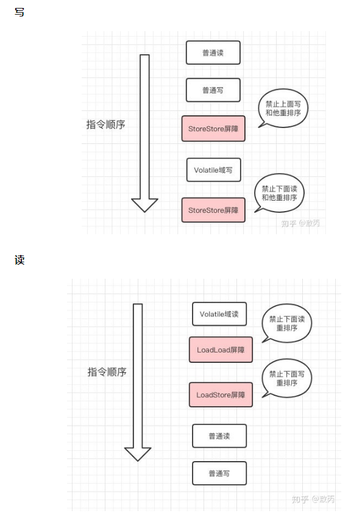

#### 1、硬件的利用效率与一致性

​		由于计算机的存储设备与处理器的运算速度相差好几个数量级，CPU经常需要等待主存，白白浪费资源，所以现代计算机加入一层或多层读写速度尽可能接近处理器运算速度的**高速缓存（Cache）**来作为内存与处理器之间的缓冲 ( 结构 : cpu -> cache -> memory ) 。

​		这种CPU多级缓存的方式很好地解决了CPU与内存速度之间的矛盾，但也引入了一个新的问题：**缓存一致性（Cache Coherence）**。为了解决一致性问题，各个处理器在访问缓存以及读写时都需要遵循一些协议，这类协议有MSI、**MESI**（Illinois Protocol）、MOSI、Synapse、Firefly及Dragon Protocol等。

​		除了增加高速缓存外，为了提高硬件的利用率，处理器还可能会对输入代码进行**乱序执行（Out-Of-Order Execution）**优化，即保证最终结果与顺序执行的一致，但不保证程序中每个语句计算的先后顺序，类似于 `JVM` 中的指令重排序优化。

#### 2、主内存与工作内存

  - 从变量、主内存、工作内存的定义来看：

    - 主内存主要对应于Java堆中的对象实例数据部分

    - 工作内存则对应虚拟机栈中的部分区域

- 从更基础的层次上说：
  - 主内存直接对应于物理硬件的内存
  - 为了获取更好的运行速度，虚拟机（或是硬件、操作系统本身的优化措施）可能会让工作内存优先存储于寄存器和高速缓存中，因为程序运行时主要访问的是工作内存。

​		JMM 规定了所有的变量都存储在主内存中，每个线程都有自己的工作内存，线程的工作内存中保存的是当前线程使用到的变量值的副本（从主内存拷贝过来的）。

​		线程对变量的所有操作都必须在工作内存中进行，不能直接读写主内存中的数据，线程之间的相互传值也需要通过主内存来完成。


<div align="center" style="font-size:12px">图2-1 线程、主内存、工作内存三者的交互关系</div>

#### 3、八种原子操作与执行规则

##### （1）八种原子操作

Java内存模型定义了以下 8 种操作来完成主内存与工作内存交互的工作：

- **lock (锁定)**：作用于主内存的变量。把一个变量标识为一条线程独占的状态。

- **unlock (解锁)**：作用于主内存的变量.把一个处于锁定状态的变量释放出来。

- **read (读取)**：作用于主内存的变量。把一个变量值从主内存传输到线程的工作内存中，以便随后的load动作使用。

- **load (载入)**：作用于工作内存的变量，它把read操作从主内存中得到的值放入工作内存的变量副本中。

- **use (使用)**：作用与工作内存的变量.它把工作内存中一个变量值传递给执行引擎，每当虚拟机遇到一个需要使用到变量的值的字节码指令时就会执行这个操作。

- **assign (赋值)**：作用于工作内存的变量，它把一个从执行引擎收到的赋值给工作内存的变量，每当虚拟机遇到一个给变量赋值的字节码指令时执行这个操作。

- **store (存储)**：作用于工作内存的变量，它把工作内存中的一个变量的值传送到主内存中，以便随后的 wirte 操作使用。

- **wirte (写入)**：作用于主内存的变量，它把 store 操作从工作内存中得到的变量值放入主内存中。

  <div align="center" style="font-size:12px">图2-2 同步操作与规则图</div>

  ##### （2）执行规则

  这 8 种原子操作的执行规则大致可以划分为两类，一类是有关变量拷贝过程的规则，另一类是有关加锁的规则。

  **有关变量拷贝过程的规则**：

  - 不允许 read 和 load，store 和 write 单独出现，即不允许一个变量从主内存读取了但工作内存不接受，或者工作内存发起回写了但主内存不接受的情况出现。
  - 不允许线程丢弃它最近的 assign 操作，即变量在工作内存中改变后必须把该变化同步回主内存中。
  - 不允许线程无原因地（没有发生过任何 assign 操作）将数据从工作内存同步回主内存中，也就是说，只有虚拟机遇到变量赋值的字节码时才会将工作内存同步回主内存。
  - 新的变量只能从主内存中诞生，即不能在工作内存中使用未被初始化（load 或 assign）的变量，一个变量在 use 和 store 前必须先经过 load 和 assign 操作。

  **有关加锁的规则**：

  - 一个变量在同一时刻只允许一个线程对其进行 lock 操作，但是 lock 操作可以被同一个线程多次执行（锁的可重入），多次执行后只有执行相同次数的 unlock 操作，变量才会被解锁。

  - 对一个变量进行 lock 操作会清空这个变量在工作内存中的值，然后在执行引擎使用这个变量时，需要通过 assign 或 load 重新对这个变量进行初始化。

  - 对一个变量执行 unlock 前，必须将该变量同步回主内存中，即执行 store 和 write 操作。

  - 一个变量没有被 lock，就不能被 unlock，也不能去 unlock一个被其他线程 lock 的变量。

    

#### 4、as-if-serial 语义

##### （1）定义

  ​		as-if-serial语义的意思是不管怎么重排序（编译器和处理器为了提高并行度），（单线程）程序的执行结果不能改变。

  ​		编译器、runtime和处理器都必须遵守as-if-serial语义。

  ​		为了遵守as-if-serial语义，编译器和处理器不会对存在数据依赖关系的操作进行重排序，因为这种重排序会改变执行结果，但反过来说，如果不存在依赖关系则可以进行重排序。

##### （2）as-if-serial 和 Happens-Before

  - as-if-serial语义保证单线程内程序的执行结果不被改变，happens-before关系保证正确同步的多线程程序的执行结果不被改变。
  - as-if-serial语义给编写单线程程序的程序员创造了一个幻境：单线程程序是按程序的顺序来执行的。
  - happens-before关系给编写正确同步的多线程程序的程序员创造了一个幻境：正确同步的多线程程序是按happens-before指定的顺序来执行的。

  > as-if-serial语义和happens-before这么做的目的，都是为了在不改变程序执行结果的前提下，尽可能地提高程序执行的并行度

  

#### 5、Happens-Before 规则

##### （1）由来

  ​		为了提高性能，编译器和处理器常常会对指令做重排序，主要包括编译器优化的重排序、指令级并行的重排序、内存系统的重排序三部分，而源代码从开始到最终执行会依次经过这三个重排序的优化。

  ​		为了避免编译优化对并发编程安全性的影响，从 JDK 5 开始 JMM 就使用 Happens-Before 规则来保证并发编程的安全性，要求编译器优化后需要满足 Happens-Before 规则。

##### （2）定义

  ​		Happens-Before，即“先行发生”规则，指的是对于不同的线程，前面的操作也应该发生在后面操作的前面，也就是说，Happens-Before 规则保证：前面的操作的结果对后面的操作一定是可见的。

  ​		它上是一种顺序约束规范，用来约束编译器的优化行为，即为了执行效率，我们允许编译器的优化行为，但是为了保证程序运行的正确性，我们要求编译器优化后需要满足 Happens-Before 规则。

##### （3）具体内容

  ​		根据类别，我们将 Happens-Before 规则分为了以下 4 类：

  - 操作的顺序：
    - **程序顺序规则**： 如果代码中操作 A 在操作 B 之前，那么同一个线程中 A 操作一定在 B 操作前执行，即在本线程内观察，所有操作都是有序的。
    - **传递性**： 在同一个线程中，如果 A 先于 B ，B 先于 C 那么 A 必然先于 C。

  - 锁和 volatile：

    - **监视器锁规则**： 监视器锁的解锁操作必须在同一个监视器锁的加锁操作前执行。
    - **volatile 变量规则**： 对 volatile 变量的写操作必须在对该变量的读操作前执行，保证时刻读取到这个变量的最新值。

  - 线程和中断：

    - **线程启动规则**： Thread#start() 方法一定先于该线程中执行的操作。
    - **线程结束规则**： 线程的所有操作先于线程的终结。
    - **中断规则**： 假设有线程 A，其他线程 interrupt A 的操作先于检测 A 线程是否中断的操作，即对一个线程的 interrupt() 操作和 interrupted() 等检测中断的操作同时发生，那么 interrupt() 先执行。

  - 对象生命周期相关：

    - **终结器规则**： 对象的构造函数执行先于 finalize() 方法。

#### 6、volatile 的实现原理

##### **（1）简介**

  ​		volatile 是 JVM 提供的最轻量级的同步机制，它可以保证数据的 **可见性**，避免出现数据脏读的现象。

  ​		volatile 变量是从工作内存中读取的，只是它有特殊的操作顺序规定，使得看起来像是直接在主内存中读写。

  ​		每个线程操作数据的时候会把数据从主内存读取到自己的工作内存，如果他操作了数据并且写回了，那其他已经读取的线程的变量副本就会失效了（volatile底层有标记当前值是否失效的状态），需要对数据进行操作又要再次去主内存中读取了。

##### （2） volatile 变量的两个特点

  ​		①**保证对所有线程的可见性**

  ​		这里的“可见性”指的是当一个线程修改了这个变量的值，新增对于其他线程来说是可以立即得知的。普通变量的值在线程间传递时需要通过主内存来完成，比如线程 A 修改一个普通变量的值，然后向主内存进行回写，而线程 B 在线程 A 回写完成了之后再对主内存进行读取操作，这时新变量值才会对线程 B 可见。

  ​		可见性的保证是基于CPU的内存屏障指令，被JSR-133抽象为happens-before原则。

  ​		②**禁止指令重排序优化**

  ​		普通变量仅会保证在该方法的执行过程中，所有依赖赋值结果的地方都能获取到正确的结果，而不能保证变量赋值操作的顺序与程序代码中的执行顺序一致。

  ​		编译时JVM编译器遵循内存屏障的约束，运行时依靠CPU屏障指令来阻止重排。

  

  <div align="center" style="font-size:12px">图2-3 volatile读写的指令图</div>

##### （3） 实现Happens-Before规则的要求

  ​		Happens-Before 原则的规定保证了操作间的可见性，volatile 变量保证了有序性和可见性，volatile 的特性得以于Java语言中的 Happens-Before 规则。		

  ​		Happens-Before 规则中要求，对 volatile 变量的写操作必须在对该变量的读操作前执行，具体实现方法分两步：

  **① 保证动作发生**

  ​		首先，在对 volatile 变量进行读取和写入操作，必须去主内存拉取最新值，或是将最新值更新进主内存，不能只更新进工作内存而不将操作同步进主内存，即在执行 read、load、use、assign、store、write 操作时：

  - use 操作必须与 load、read 操作同时出现，不能只 use，不 load、read。
    - use ← load ← read

  - assign 操作必须与 store、write 操作同时出现，不能只 assign，不 store、write。
    - assign → store → write


  ​		此时，我们已经保证了将变量的最新值时刻同步进主内存的动作发生了，接下来，我们需要保证这个动作，对于不同的线程，满足 volatile 变量的 Happens-Before 规则：**对变量的写操作必须在对该变量的读操作前执行**。

  **② 保证动作按正确的顺序发生**

  ​		其实，导致这个执行顺序问题的主要原因在于，这个读写 volatile 变量的操作不是一气呵成的，它并不是原子的。无论是读还是写，它都分成了 3 个命令（use ← load ← read 或 assign → store → write），这就导致了，你能保证 assignA 发生在 useB 之前，但你根本不能保证 writeA 也发生在 useB 之前，而如果 writeA 不发生在 useB 之前，主内存中的数据就是旧的，线程 B 就读不到最新值。

  ​		好比一个写操作，发生在它之前的读操作可以随便执行，但是发生在它之后的读操作，必须等把 3 个命令都执行完才能执行，即 **“对变量的写操作必须在对该变量的读操作前执行” **。

##### （4）volatile 的具体实现

  ​		Java 巧妙的利用了 lock 操作的特点，通过观察对 volatile 变量的赋值操作的反编译代码可以看出，在执行了变量赋值操作之后，额外加了一行：

  ```c
  lock addl $0x0,(%esp)
  ```

  这一句的意思是：给 ESP 寄存器 +0，这是一个无意义的空操作，重点在 lock 上：

  - **保证动作发生**：

    - lock 指令会将当前 CPU 的 Cache 写入内存，并无效化其他 CPU 的 Cache，相当于在执行了 assign 后，又进行了 store -> write；
    - 这使得其他 CPU 可以立即看见 volatile 变量的修改，因为其他 CPU 在读取 volatile 变量时，会发现自己的缓存过期了，于是会去主内存中拉取最新的 volatile 变量值，也就被迫在 use 前进行一次 read -> load。

  - **保证动作顺序**：

    - lock 的存在相当于一个内存屏障，使得在重排序时，不能把后面的指令排在内存屏障之前。

#### 7、final

##### （1）写final域的重排序规则

  ​		写final域的重排序规则禁止把final域的写重排序到构造函数之外。

  ​		该规则的实现依靠编译器在final域的写之后，构造函数return之前，插入一个StoreStore屏障。这个屏障禁止处理器把final域的写重排序到构造函数之外。

  ​		写final域的重排序规则的作用：可以确保在对象引用为任意线程可见之前，对象的final域已经被正确初始化过了，而普通域不具备这个报障。

##### （2）读final域的重排序规则

  ​		读final域的重排序规则是在一个线程中，初次读对象引用与随后初次读该对象包含的final域，JMM禁止处理器重排序这两个操作（注意该规则仅针对处理器）。

  ​		该规则的实现依靠编译器在读final域操作的前面插入一个LoadLoad屏障。

  ​		读final域的重排序规则的作用：可以确保在读一个对象的final域之前，一定会先读包含这个final域的对象的引用。如果引用不为null，那引用对象的final域一定已经被初始化了。

  

  

------

  关于 volatile 详细解析：

  https://www.zhihu.com/question/31990408/answer/1028941563

  https://zhuanlan.zhihu.com/p/137193948
