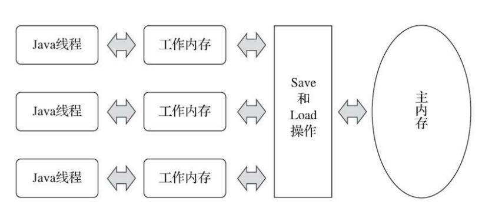
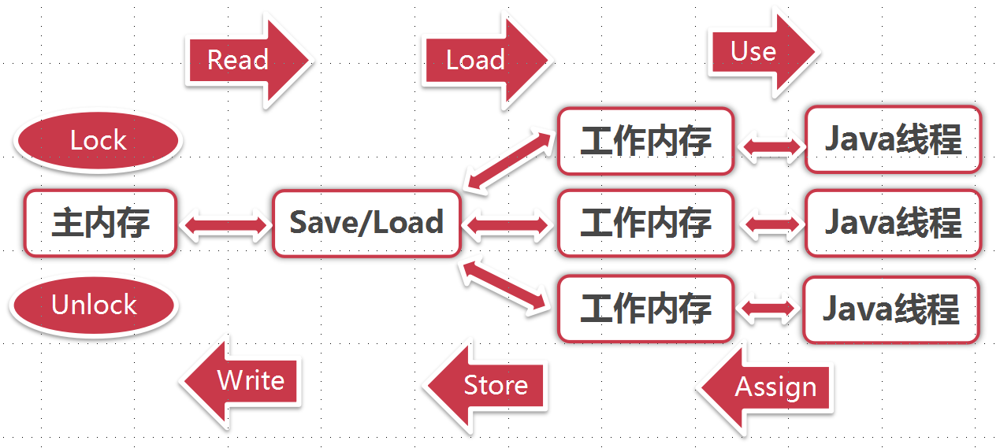
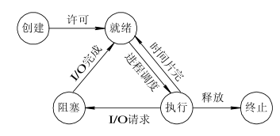
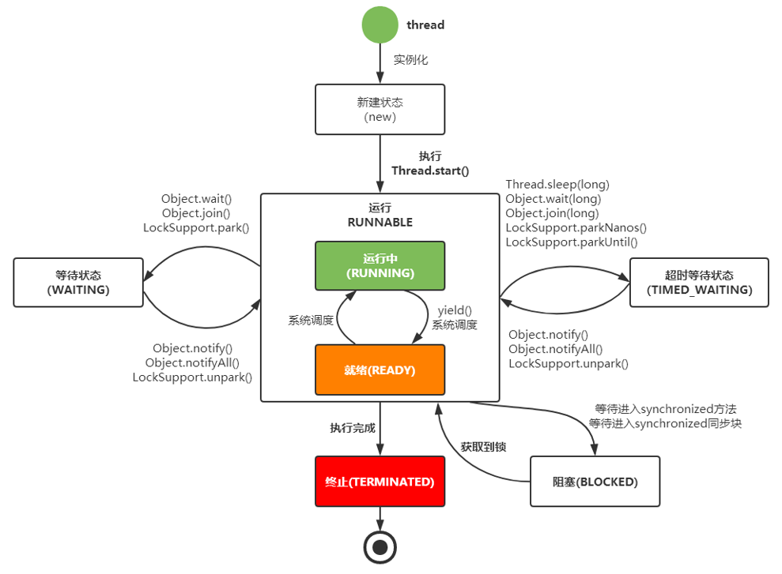

### 一、Java内存模型简介

#### 1、硬件的利用效率与一致性

 		由于计算机的存储设备与处理器的运算速度相差好几个数量级，CPU长长需要等待主存，浪费资源，所以现代计算机不得不加入一层或多层读写速度尽可能接近处理器运算速度的**高速缓存（Cache）**来作为内存与处理器之间的缓冲 ( 结构 : cpu -> cache -> memory ) 。

​		这种CPU多级缓存的方式很好地解决了CPU与内存速度之间的矛盾，但也引入了一个新的问题：**缓存一致性（Cache Coherence）**。为了解决一致性问题，各个处理器在访问缓存时都需要遵循一些协议，在读写时要根据协议来进行操作，这类协议有MSI、**MESI**（Illinois Protocol）、MOSI、Synapse、Firefly及Dragon Protocol等。

​		除了增加高速缓存之外，为了提高硬件的利用效率，处理器还可能会对输入代码进行**乱序执行（Out-Of-Order Execution）**优化，即保证最终结果与顺序执行的一致，但不保证程序中每个语句计算的先后顺序，类似于Java虚拟机中的指令重排序优化。

#### 2、主内存与工作内存

​		从变量、主内存、工作内存的定义来看，主内存主要对应于Java堆中的对象实例数据部分，而工作内存则对应虚拟机栈中的部分区域；从更基础的层次上说，主内存直接对应于物理硬件的内存，而为了获取更好的运行速度，虚拟机（或是硬件、操作系统本身的优化措施）可能会让工作内存优先存储于寄存器和高速缓存中，因为程序运行时主要访问的是工作内存。

​		Java内存模型规定了所有的变量都存储在主内存中，每天线程都有自己的工作内存，线程的工作内存中保存的是当前线程使用到的变量值的副本（从主内存拷贝过来的）。

​		线程对变量的所有操作都必须在工作内存中进行，不能直接读写主内存中的数据，线程之间的相互传值也需要通过主内存来完成。



<div align="center" style="font-size:12px">图1-1 线程、主内存、工作内存三者的交互关系</div>

#### 3、八种原子操作与执行规则

##### （1）八种原子操作

Java内存模型定义了以下 8 种操作来完成主内存与工作内存交互的工作：

- **lock (锁定)**：作用于主内存的变量。把一个变量标识为一条线程独占的状态。

- **unlock (解锁)**：作用于主内存的变量.把一个处于锁定状态的变量释放出来。

- **read (读取)**：作用于主内存的变量。把一个变量值从主内存传输到线程的工作内存中，以便随后的load动作使用。

- **load (载入)**：作用于工作内存的变量，它把read操作从主内存中得到的值放入工作内存的变量副本中。

- **use (使用)**：作用与工作内存的变量.它把工作内存中一个变量值传递给执行引擎，每当虚拟机遇到一个需要使用到变量的值的字节码指令时就会执行这个操作。

- **assign (赋值)**：作用于工作内存的变量，它把一个从执行引擎收到的赋值给工作内存的变量，每当虚拟机遇到一个给变量赋值的字节码指令时执行这个操作。

- **store (存储)**：作用于工作内存的变量，它把工作内存中的一个变量的值传送到主内存中，以便随后的 wirte 操作使用。

- **wirte (写入)**：作用于主内存的变量，它把 store 操作从工作内存中得到的变量值放入主内存中。

  <div align="center" style="font-size:12px">图1-2 同步操作与规则图</div>

  ##### （2）执行规则

  这 8 种原子操作的执行规则大致可以划分为两类，一类是有关变量拷贝过程的规则，另一类是有关加锁的规则。

  **有关变量拷贝过程的规则**：

  - 不允许 read 和 load，store 和 write 单独出现，即不允许一个变量从主内存读取了但工作内存不接受，或者工作内存发起回写了但主内存不接受的情况出现。
  - 不允许线程丢弃它最近的 assign 操作，即变量在工作内存中改变后必须把该变化同步回主内存中。
  - 不允许线程无原因地（没有发生过任何 assign 操作）将数据从工作内存同步回主内存中，也就是说，只有虚拟机遇到变量赋值的字节码时才会将工作内存同步回主内存。
  - 新的变量只能从主内存中诞生，即不能在工作内存中使用未被初始化（load 或 assign）的变量，一个变量在 use 和 store 前必须先经过 load 和 assign 操作。

  **有关加锁的规则**：

  - 一个变量在同一时刻只允许一个线程对其进行 lock 操作，但是 lock 操作可以被同一个线程多次执行（锁的可重入），多次执行后只有执行相同次数的 unlock 操作，变量才会被解锁。

  - 对一个变量进行 lock 操作会清空这个变量在工作内存中的值，然后在执行引擎使用这个变量时，需要通过 assign 或 load 重新对这个变量进行初始化。
  - 对一个变量执行 unlock 前，必须将该变量同步回主内存中，即执行 store 和 write 操作。
  - 一个变量没有被 lock，就不能被 unlock，也不能去 unlock一个被其他线程 lock 的变量。

  #### 4、Happens-Before 规则

  ​		Happens-Before，即“先行发生”规则，指的是对于不同的线程，前面的操作也应该发生在后面操作的前面，也就是说，Happens-Before 规则保证：前面的操作的结果对后面的操作一定是可见的。

  ​		它上是一种顺序约束规范，用来约束编译器的优化行为，即为了执行效率，我们允许编译器的优化行为，但是为了保证程序运行的正确性，我们要求编译器优化后需要满足 Happens-Before 规则。

  ​		根据类别，我们将 Happens-Before 规则分为了以下 4 类：

  - 操作的顺序：

  - - **程序顺序规则**： 如果代码中操作 A 在操作 B 之前，那么同一个线程中 A 操作一定在 B 操作前执行，即在本线程内观察，所有操作都是有序的。
    - **传递性**： 在同一个线程中，如果 A 先于 B ，B 先于 C 那么 A 必然先于 C。

  - 锁和 volatile：

  - - **监视器锁规则**： 监视器锁的解锁操作必须在同一个监视器锁的加锁操作前执行。
    - **volatile 变量规则**： 对 volatile 变量的写操作必须在对该变量的读操作前执行，保证时刻读取到这个变量的最新值。

  - 线程和中断：

  - - **线程启动规则**： Thread#start() 方法一定先于该线程中执行的操作。
    - **线程结束规则**： 线程的所有操作先于线程的终结。
    - **中断规则**： 假设有线程 A，其他线程 interrupt A 的操作先于检测 A 线程是否中断的操作，即对一个线程的 interrupt() 操作和 interrupted() 等检测中断的操作同时发生，那么 interrupt() 先执行。

  - 对象生命周期相关：

  - - **终结器规则**： 对象的构造函数执行先于 finalize() 方法。

  #### 5、volatile 的实现原理

  ##### （1） volatile 变量的两个特点

  - **保证对所有线程的可见性**

    这里的“可见性”指的是当一个线程修改了这个变量的值，新增对于其他线程来说是可以立即得知的。普通变量的值在线程间传递时需要通过主内存来完成，比如线程 A 修改一个普通变量的值，然后向主内存进行回写，而线程 B 在线程 A 回写完成了之后再对主内存进行读取操作，这时新变量值才会对线程 B 可见。

  - **禁止指令重排序优化**

    普通变量仅会保证在该方法的执行过程中，所有依赖赋值结果的地方都能获取到正确的结果，而不能保证变量赋值操作的顺序与程序代码中的执行顺序一致。

  > volatile 变量是从工作内存中读取的，只是它有特殊的操作顺序规定，使得看起来像是直接在主内存中读写。每个线程操作数据的时候会把数据从主内存读取到自己的工作内存，如果他操作了数据并且写回了，那其他已经读取的线程的变量副本就会失效了，需要都数据进行操作又要再次去主内存中读取了。

  ##### （2） 实现Happens-Before规则的要求

  Happens-Before 规则中要求，对 volatile 变量的写操作必须在对该变量的读操作前执行，具体实现方法分两步：

  **① 保证动作发生**

  ​		首先，在对 volatile 变量进行读取和写入操作，必须去主内存拉取最新值，或是将最新值更新进主内存，不能只更新进工作内存而不将操作同步进主内存，即在执行 read、load、use、assign、store、write 操作时：

  - use 操作必须与 load、read 操作同时出现，不能只 use，不 load、read。

  - - use <- load <- read

  - assign 操作必须与 store、write 操作同时出现，不能只 assign，不 store、write。

  - - assign -> store -> write

  

  ​		此时，我们已经保证了将变量的最新值时刻同步进主内存的动作发生了，接下来，我们需要保证这个动作，对于不同的线程，满足 volatile 变量的 Happens-Before 规则：对变量的写操作必须在对该变量的读操作前执行。

  **② 保证动作按正确的顺序发生**

  ​		其实，导致这个执行顺序问题的主要原因在于，这个读写 volatile 变量的操作不是一气呵成的，它并不是原子的。无论是读还是写，它都分成了 3 个命令（use <- load <- read 或 assign -> store -> write），这就导致了，你能保证 assignA 发生在 useB 之前，但你根本不能保证 writeA 也发生在 useB 之前，而如果 writeA 不发生在 useB 之前，主内存中的数据就是旧的，线程 B 就读不到最新值。

  ​		所以，我觉得这句话应当换一个理解方式：假设我是一个写操作，你发生在我之前的读操作可以随便执行，各个分解命令先于我还是后于我都无所谓。但是，你发生在我之后的读操作，必须等我把 3 个命令都执行完才能执行，不许偷偷把一些指令排到我的最后一个指令的前面去。 这才是 “对变量的写操作必须在对该变量的读操作前执行” 的本质。

  

  ##### （3）volatile 的具体实现

  ​		Java 巧妙的利用了 lock 操作的特点，通过观察对 volatile 变量的赋值操作的反编译代码可以看出，在执行了变量赋值操作之后，额外加了一行：

  ```
  lock addl $0x0,(%esp)
  ```

  这一句的意思是：给 ESP 寄存器 +0，这是一个无意义的空操作，重点在 lock 上：

  - **保证动作发生**：

  - - lock 指令会将当前 CPU 的 Cache 写入内存，并无效化其他 CPU 的 Cache，相当于在执行了 assign 后，又进行了 store -> write；
    - 这使得其他 CPU 可以立即看见 volatile 变量的修改，因为其他 CPU 在读取 volatile 变量时，会发现自己的缓存过期了，于是会去主内存中拉取最新的 volatile 变量值，也就被迫在 use 前进行一次 read -> load。

  - **保证动作顺序**：

  - - lock 的存在相当于一个内存屏障，使得在重排序时，不能把后面的指令排在内存屏障之前。

  

  关于 volatile 详细解析：

  https://www.zhihu.com/question/31990408/answer/1028941563

  https://zhuanlan.zhihu.com/p/137193948

### 二、线程

#### 1、线程的概念

​		进程是指一个内存中运行的应用程序，它是操作系统资源分配的最小单位。每个进程都有自己独立的一块内存空间，而一个进程中可以启动多个线程。

​		线程是比进程更轻量级的调度执行单位，它是进程的一个执行单元。线程的引入可以把一个进程的资源分配和执行调度分开，各个线程之间既可以共享进程资源（内存地址、文件IO等），又可以独立调度。

#### 2、线程的实现模型

​	Java 使用的是 1：1 线程模型，Python 的gevent使用的是 1：N 线程模型，而 Go 使用的是 N：M 线程模型。

##### （1）内核线程实现（1：1实现）

​		内核线程（Kernel-Level Thread，KLT）就是由操作系统内核（Kernel）支持的线程，这种线程由内核来完成线程切换操作。

​		程序一般不会直接使用内核线程（那样太危险了），而是使用内核线程的一种高级接口——轻量级进程（Light Wegiht Process，LWP）来操作内核进程。轻量级进程即我们常说的线程，由于每个轻量级线程都由一个内核线程支持，也就是说 LWP 和KLT 之间是 1：1 的关系，因此也称这种模型为一对一的线程模型。

​		这类似于一种代理模式，LWP 就是代理对象，而 KLT 则是被代理对象，我们把任务请求发给代理人 LWP，然后 LWP 会通过调用真实具备执行任务能力的被代理人 KLT 去执行任务。


<div align="center" style="font-size:12px">图1-3 轻量级进程与内核线程之间1：1的关系图</div>

- **优点**：

- - 每个 LWP 都是一个独立的调度单元，即便有一个 LWP 在系统调用中被阻塞了，也不会影响整个进程继续工作，系统的稳定性会比较好。
  - 线程的调度和各种操作都委托给了操作系统，所以实现上比较简单。

- **缺点**：

- - 各种线程操作（创建、析构、同步等）都需要进行系统调用，而系统调用的代价较高，需要在**用户态**和**内核态**中来回切换，这需要消耗掉一定时间。
  - 每个 LWP 都需要一个 KLT 支持，即每个 LWP 都会消耗掉一部分内核资源（例如内核线程的栈空间），因此系统可以支持的 LWP 数量是有限的。

##### （2）用户线程实现（1：N实现）

​		广义上讲，一个线程只要不是 KLT ，都可以认为是用户线程（User Thread，UT）的一种。

​		狭义上讲， UT 指的是完全建立在用户空间的线程，即操作系统感知不到线程的存在，只知道那个掌控着这些 UT 的进程 P 。因此，进程和 UT 之间的比例是 1：N 。


<div align="center" style="font-size:12px">图1-4 进程与用户线程之间1：N的关系图</div>

- **优点**：

- - UT 的创建、同步、销毁、调度都是在用户态完成的，完全不需要切换到内核态，因此各种线程操作可以非常快速且低消耗。
  - 由于进程和 UT 之间的比例为 1：N，所以可以支持更大规模的 UT 数量，部分高性能数据库中的多线程就是由 UT 实现的。

- **缺点**：

- - 由于没有系统内核的支持，所以所有的线程操作都需要程序自己实现，这就使得 UT 的实现程序通常都比较复杂，甚至有些是不可能实现的。

> 现在使用 UT 的程序越来越少了，Java 和 Ruby 等语言都曾使用过 UT ，但最终又放弃了，而 Golang 、 Erlang 等以高并发为卖点的新语言则普遍支持了 UT 。

##### （3）用户线程加轻量级进程混合实现（N：M实现）

​		这种混合模式下，既存在 UT ，也存在 KLT ，被称之为 N：M 实现。


<div align="center" style="font-size:12px">图1-5 用户线程与轻量级进程之间N：M的关系图</div>

该实现模型有以下特点：

- UT 还是完全建立在用户空间中，因此线程的创建、切换、析构等消耗依旧很小，同时也可以支持大规模的 UT 并发。
- 对于线程的调度，则使用 LWP 作为 UT 和 KLT 之间的桥梁，这样可以使用操作系统提供的线程调度功能和处理器映射了。
- UT 的系统调用要通过 LWP 来完成，大大降低了整个进程被完全阻塞的风险。
- UT 和 LWP 之间的数量比是不定的，即两者数量是 N：M 的关系。

> 许多UNIX系列的操作系统，如Solaris、HP-UX等都提供了M：N的线程模型实现

#### 3、线程的调度

​		线程调度是指系统为线程分配处理器使用权的过程，调度主要方式有两种，分别是协同式（Cooperative Threads-Scheduling）线程调度和抢占式（Preemptive Threads-Scheduling）线程调度。

- **协同式线程调度**： 线程的执行时间由线程本身来控制，线程执行完自己的任务之后，主动通知系统切换到另一个线程。

- - 优点： 实现简单，切换操作对于线程自己可知，一般没有线程同步的问题。
  - 缺点： 线程执行时间不可控，如果一个线程编写有问题而一直不告知系统进行线程切换，程序会一直阻塞在那里。

- **抢占式线程调度**： 每个线程由系统分配执行时间，线程的切换不由程序本身来决定，而是由系统决定。

- - 优点： 线程执行时间可控，不会因一个线程出错而耽误整个进程乃至系统。

- - 缺点： 存在线程同步的问题，并且线程切换控制比较复杂。

- - Java 使用的线程调度方式就是这种。

#### 4、线程的生命周期状态

##### （1）通用的线程生命周期

​		通用的线程生命周期模型主要将线程的状态分为以下五种：

- **初始：**线程从创建到被cpu执行之前的这个阶段。这个状态下的线程仅仅是在编程语言层面被创建，而在操作系统层面并没有被创建，因此还不能被分配CPU资源，这相当于Java中new了个Thread对象但还没调用 start() 方法。
- **就绪：**指线程可以分配cpu执行。在这种状态下，真正的操作系统线程已经被成功创建了，所以可以分配 CPU 执行。
- **运行：**表示线程正获得cpu在运行。当有空闲的CPU资源时，操作系统会将资源分配给处于就绪状态的线程，这时线程的状态就将转为运行状态
- **阻塞：**指线程在执行中因某件事而受阻，处于暂停执行的状态，并且放弃自己的CPU使用权。当它的阻塞状态结束了，它的状态会变为就绪状态，等待再次被分配 CPU 资源。
- **终止：**当线程执行完或出现异常时，它就会进入终止状态，不会再切换到其他任何状态，这也意味着线程的生命周期结束了。



<div align="center" style="font-size:12px">图1-6 通用的线程生命周期图</div>

##### （2）Java 的线程生命周期

​		Java语言中线程共有六种状态：

- **新建（New）**：创建后尚未启动的线程处于这种状态。
- **运行（Runnable）**：包含操作系统线程状态中的就绪和运行状态，处于该状态的线程可能正在执行，也可能在等待着操作系统为它分配CPU资源。
- **等待（Waiting）**：处于这种状态的线程不会被分配CPU资源，它们要等待被其他线程显式唤醒。
- **超时等待（Timed Waiting）**：处于这种状态的线程不会被分配CPU资源，不过在一定时间之后，即使不被其他线程显示唤醒，也会由操作系统自动唤醒。
- **阻塞（Blocked）**：线程被阻塞了，“阻塞状态”与“等待状态”的区别是“阻塞状态”在等待着获取到一个排它锁，这个事件将在另外一个线程放弃这个锁的时候发生；而“等待状态”则是在等待一段时间，或者唤醒动作的发生。
- **结束（Terminated）**：已终止线程的线程状态，线程已经结束执行。



<div align="center" style="font-size:12px">图1-7 Java线程的生命周期图</div>

#### 5、Java 多线程的实现方式

##### （1）继承 Thread 类

​		Java 中提供了一个 java.lang.Thread 的程序类，底层是继承了Runnable接口的实现类。一个类只需要继承此类就表示此类为线程的主体，再覆写一个run()方法，就可以使用start()方法启动线程了。

​		选择继承Thread类实现多线程的缺点是扩展性差，因为Java程序只允许单继承一个类。

```java
class MyThread extends Thread {//线程主体类
    private String name;
    public MyThread(String name) {
        this.name = name;
    }
    @Override
    public void run() {//线程的主体方法
        System.out.println("test: " + this.name);
    }
}
```

​		任何情况下，只要定义了多线程，那么多线程的启动永远只有一种方法，即Thread类的start()方法。

##### （2）实现 Runnable 接口

​		一般情况下多线程多采用实现java.lang.Runnable接口的方式实现，因为这样做不会有单继承的局限性，扩展性更佳，不过启动时还是需要通过Thread类实现。

```java
class MyThread implements Runnable{//线程主体类
    private String name;
    public MyThread(String name) {
        this.name = name;
    }
    @Override
    public void run() {//线程的主体方法
        System.out.println("test: " + this.name);
    }
}

public class ThreadDemo {
    public static void main(String[] args) {
        Thread threadA = new Thread(new MyThread("线程A"));
        Thread threadB = new Thread(new MyThread("线程B"));
        threadA.start();
        threadB.start();
    }
}
```


##### （3）实现 Callable 接口

​		如果当线程执行完毕时，需要获取它的返回值，那么就可以采用Callable接口实现多线程（Runnable接口的线程无返回值）。

```java
Callable接口的源码

@FunctionalInterface
public interface Callable<V> {
 public V call() throws Exception;
}
```

​		Callbale定义的时候可以设置一个泛型，此泛型的类型就是返回数据的类型，这样的的好处是可以避免向下转行所带来的安全隐患。

```java
class MyThread implements Callable<String> {
    @Override
    public String call() throws Exception {
        for ( int x = 0 ; x < 10 ; x ++ ) {
            System.out.println("thread work，x = " + x);
        }
        return "finished";
    }
}
public class demo {
    public static void main(String[] args) throws Exception{
        FutureTask futureTask = new FutureTask(new MyThread());
        new Thread(futureTask).start();
        System.out.println("thread return：" + futureTask.get());
    }
}
```

**Runnable 与 Callable的区别：**

- Runnable是在JDK1.0的时候提出的多线程的实现接口，而Callable是在JDK1.5之后提出的；
- java.lang.Runnable 接口之中只提供了一个run（）方法，并且没有返回值；
- java.util.concurrent.Callable接口提供有call()，可以有返回值；