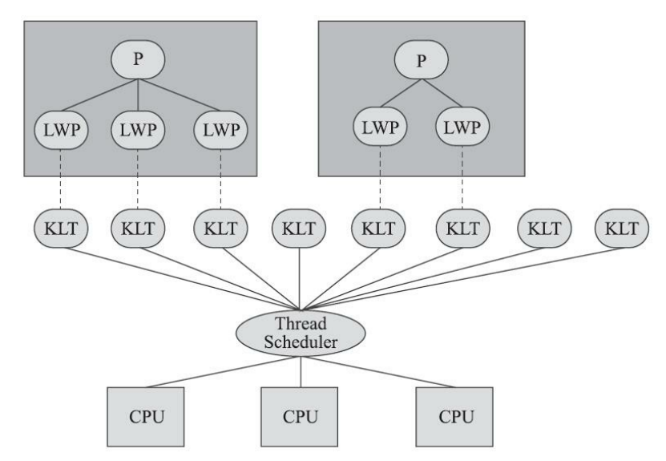
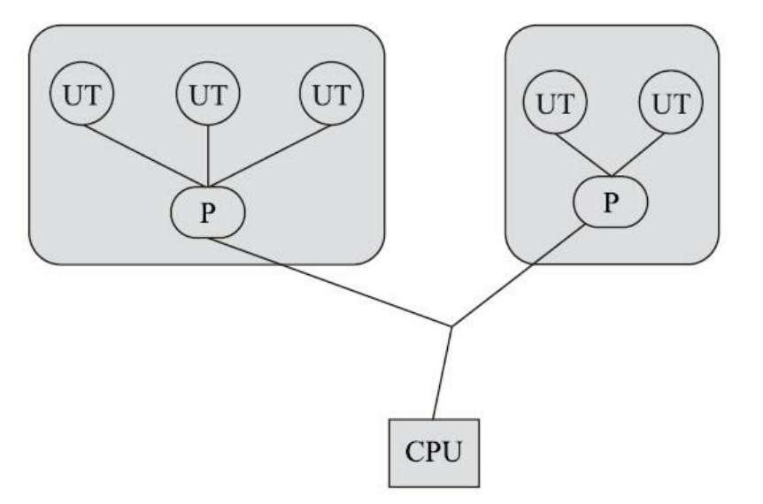
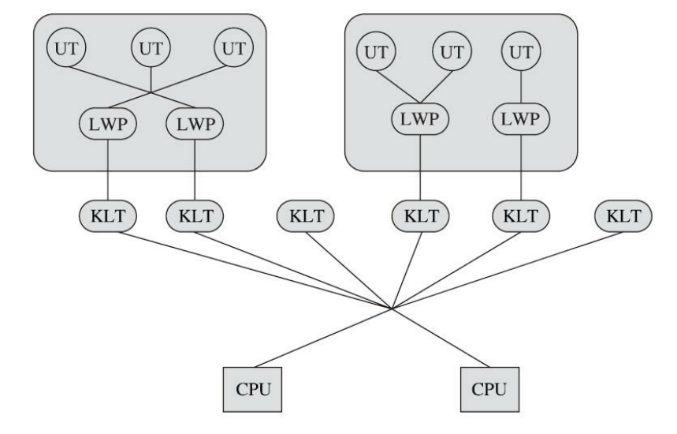

#### 1、线程的概念

​		进程是指一个内存中运行的应用程序，它是操作系统资源分配的最小单位。每个进程都有自己独立的一块内存空间，而一个进程中可以启动多个线程。

​		线程是比进程更轻量级的调度执行单位，它是进程的一个执行单元。线程的引入可以把一个进程的资源分配和执行调度分开，各个线程之间既可以共享进程资源（内存地址、文件IO等），又可以独立调度。

#### 2、线程的实现模型

​	Java 使用的是 1：1 线程模型，Python 的gevent使用的是 1：N 线程模型，而 Go 使用的是 N：M 线程模型。

##### （1）内核线程实现（1：1实现）

​		内核线程（Kernel-Level Thread，KLT）就是由操作系统内核（Kernel）支持的线程，这种线程由内核来完成线程切换操作。

​		程序一般不会直接使用内核线程（那样太危险了），而是使用内核线程的一种高级接口——轻量级进程（Light Wegiht Process，LWP）来操作内核进程。轻量级进程即我们常说的线程，由于每个轻量级线程都由一个内核线程支持，也就是说 LWP 和KLT 之间是 1：1 的关系，因此也称这种模型为一对一的线程模型。

​		这类似于一种代理模式，LWP 就是代理对象，而 KLT 则是被代理对象，我们把任务请求发给代理人 LWP，然后 LWP 会通过调用真实具备执行任务能力的被代理人 KLT 去执行任务。



<div align="center" style="font-size:12px">图3-1 轻量级进程与内核线程之间1：1的关系图</div>

- **优点**：

- - 每个 LWP 都是一个独立的调度单元，即便有一个 LWP 在系统调用中被阻塞了，也不会影响整个进程继续工作，系统的稳定性会比较好。
  - 线程的调度和各种操作都委托给了操作系统，所以实现上比较简单。

- **缺点**：

- - 各种线程操作（创建、析构、同步等）都需要进行系统调用，而系统调用的代价较高，需要在**用户态**和**内核态**中来回切换，这需要消耗掉一定时间。
  - 每个 LWP 都需要一个 KLT 支持，即每个 LWP 都会消耗掉一部分内核资源（例如内核线程的栈空间），因此系统可以支持的 LWP 数量是有限的。

##### （2）用户线程实现（1：N实现）

​		广义上讲，一个线程只要不是 KLT ，都可以认为是用户线程（User Thread，UT）的一种。

​		狭义上讲， UT 指的是完全建立在用户空间的线程，即操作系统感知不到线程的存在，只知道那个掌控着这些 UT 的进程 P 。因此，进程和 UT 之间的比例是 1：N 。



<div align="center" style="font-size:12px">图3-2 进程与用户线程之间1：N的关系图</div>

- **优点**：

- - UT 的创建、同步、销毁、调度都是在用户态完成的，完全不需要切换到内核态，因此各种线程操作可以非常快速且低消耗。
  - 由于进程和 UT 之间的比例为 1：N，所以可以支持更大规模的 UT 数量，部分高性能数据库中的多线程就是由 UT 实现的。

- **缺点**：

- - 由于没有系统内核的支持，所以所有的线程操作都需要程序自己实现，这就使得 UT 的实现程序通常都比较复杂，甚至有些是不可能实现的。

> 现在使用 UT 的程序越来越少了，Java 和 Ruby 等语言都曾使用过 UT ，但最终又放弃了，而 Golang 、 Erlang 等以高并发为卖点的新语言则普遍支持了 UT 。

##### （3）用户线程加轻量级进程混合实现（N：M实现）

​		这种混合模式下，既存在 UT ，也存在 KLT ，被称之为 N：M 实现。



<div align="center" style="font-size:12px">图3-3 用户线程与轻量级进程之间N：M的关系图</div>

该实现模型有以下特点：

- UT 还是完全建立在用户空间中，因此线程的创建、切换、析构等消耗依旧很小，同时也可以支持大规模的 UT 并发。
- 对于线程的调度，则使用 LWP 作为 UT 和 KLT 之间的桥梁，这样可以使用操作系统提供的线程调度功能和处理器映射了。
- UT 的系统调用要通过 LWP 来完成，大大降低了整个进程被完全阻塞的风险。
- UT 和 LWP 之间的数量比是不定的，即两者数量是 N：M 的关系。

> 许多UNIX系列的操作系统，如Solaris、HP-UX等都提供了M：N的线程模型实现

#### 3、线程的调度

​		线程调度是指系统为线程分配处理器使用权的过程，调度主要方式有两种，分别是协同式（Cooperative Threads-Scheduling）线程调度和抢占式（Preemptive Threads-Scheduling）线程调度。

- **协同式线程调度**： 线程的执行时间由线程本身来控制，线程执行完自己的任务之后，主动通知系统切换到另一个线程。

- - 优点： 实现简单，切换操作对于线程自己可知，一般没有线程同步的问题。
  - 缺点： 线程执行时间不可控，如果一个线程编写有问题而一直不告知系统进行线程切换，程序会一直阻塞在那里。

- **抢占式线程调度**： 每个线程由系统分配执行时间，线程的切换不由程序本身来决定，而是由系统决定。

- - 优点： 线程执行时间可控，不会因一个线程出错而耽误整个进程乃至系统。

- - 缺点： 存在线程同步的问题，并且线程切换控制比较复杂。

- - Java 使用的线程调度方式就是这种。

#### 4、线程的生命周期状态

##### （1）通用的线程生命周期

​		通用的线程生命周期模型主要将线程的状态分为以下五种：

- **初始：**线程从创建到被cpu执行之前的这个阶段。这个状态下的线程仅仅是在编程语言层面被创建，而在操作系统层面并没有被创建，因此还不能被分配CPU资源，这相当于Java中new了个Thread对象但还没调用 start() 方法。
- **就绪：**指线程可以分配cpu执行。在这种状态下，真正的操作系统线程已经被成功创建了，所以可以分配 CPU 执行。
- **运行：**表示线程正获得cpu在运行。当有空闲的CPU资源时，操作系统会将资源分配给处于就绪状态的线程，这时线程的状态就将转为运行状态
- **阻塞：**指线程在执行中因某件事而受阻，处于暂停执行的状态，并且放弃自己的CPU使用权。当它的阻塞状态结束了，它的状态会变为就绪状态，等待再次被分配 CPU 资源。
- **终止：**当线程执行完或出现异常时，它就会进入终止状态，不会再切换到其他任何状态，这也意味着线程的生命周期结束了。


<div align="center" style="font-size:12px">图3-4 通用的线程生命周期图</div>

##### （2）Java 的线程生命周期

​		Java语言中线程共有六种状态：

- **新建（New）**：创建后尚未启动的线程处于这种状态。
- **运行（Runnable）**：包含操作系统线程状态中的就绪和运行状态，处于该状态的线程可能正在执行，也可能在等待着操作系统为它分配CPU资源。
- **等待（Waiting）**：处于这种状态的线程不会被分配CPU资源，它们要等待被其他线程显式唤醒。
- **超时等待（Timed Waiting）**：处于这种状态的线程不会被分配CPU资源，不过在一定时间之后，即使不被其他线程显示唤醒，也会由操作系统自动唤醒。
- **阻塞（Blocked）**：线程被阻塞了，“阻塞状态”与“等待状态”的区别是“阻塞状态”在等待着获取到一个排它锁，这个事件将在另外一个线程放弃这个锁的时候发生；而“等待状态”则是在等待一段时间，或者唤醒动作的发生。
- **结束（Terminated）**：已终止线程的线程状态，线程已经结束执行。


<div align="center" style="font-size:12px">图3-5 Java线程的生命周期图</div>

#### 5、Java 多线程的实现方式

##### （1）继承 Thread 类

​		Java 中提供了一个 java.lang.Thread 的程序类，底层是继承了Runnable接口的实现类。一个类只需要继承此类就表示此类为线程的主体，再覆写一个run()方法，就可以使用start()方法启动线程了。

​		选择继承Thread类实现多线程的缺点是扩展性差，因为Java程序只允许单继承一个类。

```java
class MyThread extends Thread {//线程主体类
    private String name;
    public MyThread(String name) {
        this.name = name;
    }
    @Override
    public void run() {//线程的主体方法
        System.out.println("test: " + this.name);
    }
}
```

​		任何情况下，只要定义了多线程，那么多线程的启动永远只有一种方法，即Thread类的start()方法。

##### （2）实现 Runnable 接口

​		一般情况下多线程多采用实现java.lang.Runnable接口的方式实现，因为这样做不会有单继承的局限性，扩展性更佳，不过启动时还是需要通过Thread类实现。

```java
class MyThread implements Runnable{//线程主体类
    private String name;
    public MyThread(String name) {
        this.name = name;
    }
    @Override
    public void run() {//线程的主体方法
        System.out.println("test: " + this.name);
    }
}

public class ThreadDemo {
    public static void main(String[] args) {
        Thread threadA = new Thread(new MyThread("线程A"));
        Thread threadB = new Thread(new MyThread("线程B"));
        threadA.start();
        threadB.start();
    }
}
```


##### （3）实现 Callable 接口

​		如果当线程执行完毕时，需要获取它的返回值，那么就可以采用Callable接口实现多线程（Runnable接口的线程无返回值）。

```java
Callable接口的源码

@FunctionalInterface
public interface Callable<V> {
 public V call() throws Exception;
}
```

​		Callbale定义的时候可以设置一个泛型，此泛型的类型就是返回数据的类型，这样的的好处是可以避免向下转行所带来的安全隐患。

```java
class MyThread implements Callable<String> {
    @Override
    public String call() throws Exception {
        for ( int x = 0 ; x < 10 ; x ++ ) {
            System.out.println("thread work，x = " + x);
        }
        return "finished";
    }
}
public class demo {
    public static void main(String[] args) throws Exception{
        FutureTask futureTask = new FutureTask(new MyThread());
        new Thread(futureTask).start();
        System.out.println("thread return：" + futureTask.get());
    }
}
```

**Runnable 与 Callable的区别：**

- Runnable是在JDK1.0的时候提出的多线程的实现接口，而Callable是在JDK1.5之后提出的；

- java.lang.Runnable 接口之中只提供了一个run（）方法，并且没有返回值；

- java.util.concurrent.Callable接口提供有call()，可以有返回值；

  

#### 6、启动与终止线程的方法

​		启动线程是调用线程类的start()方法即可，但终止线程不能使用stop()方法，因为它在终止线程时不会保证占用得线程资源会被正常释放。

​		suspend()方法是暂停线程，线程进入休眠时也不会释放被占用的资源。

​		比较安全地终止线程的方法是设置控制信号变量，或者使用 interrup() 方法

```java
public class Shutdown {
    public static void main(String[] args) throws Exception {
        Runner one = new Runner();
        Thread countThread = new Thread(one, "CountThread");
        countThread.start();
        // 睡眠1秒，main线程对CountThread进行中断，使CountThread能够感知中断而结束
        TimeUnit.SECONDS.sleep(1);
        countThread.interrupt();
        Runner two = new Runner();
        countThread = new Thread(two, "CountThread");
        countThread.start();
        // 睡眠1秒，main线程对Runner two进行取消，使CountThread能够感知on为false而结束
        TimeUnit.SECONDS.sleep(1);
        two.cancel();
    }
    private static class Runner implements Runnable {
        private long i;
            private volatile boolean on = true;
            @Override
            public void run() {
            while (on && !Thread.currentThread().isInterrupted()){
                i++;
            }
            System.out.println("Count i = " + i);
        }
        public void cancel() {
            on = false;
        }
    }
}
```

