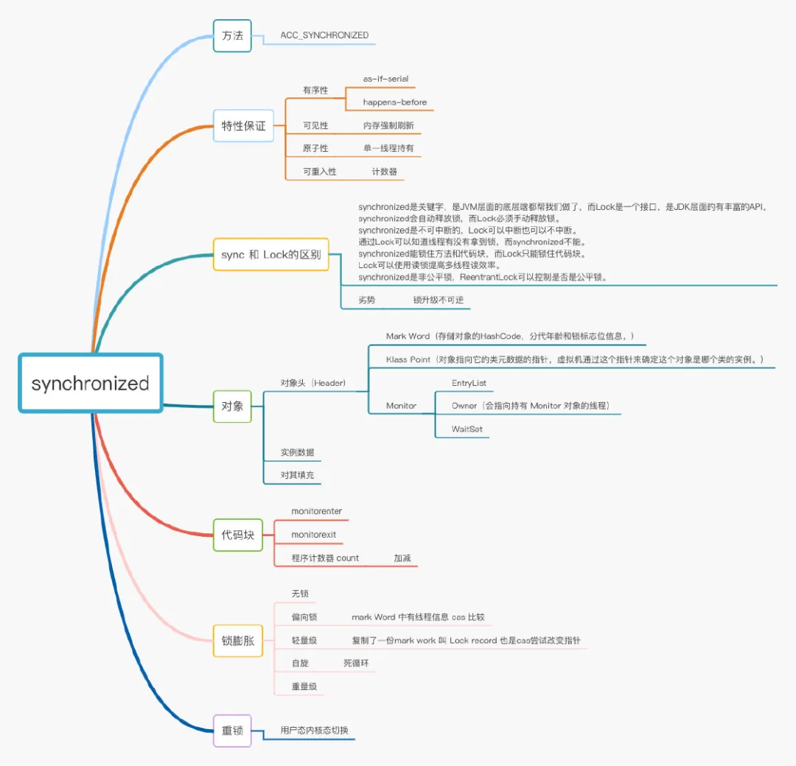
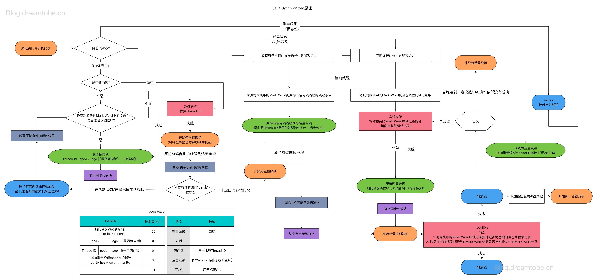
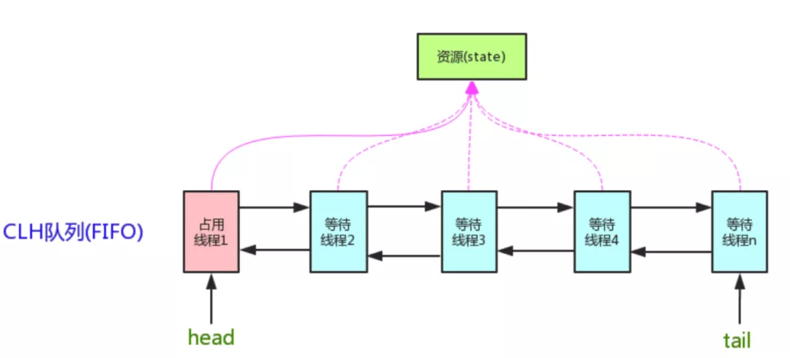
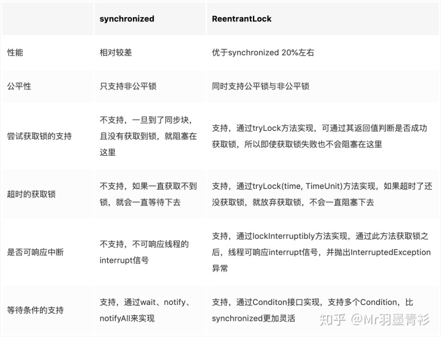
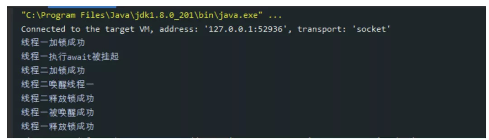
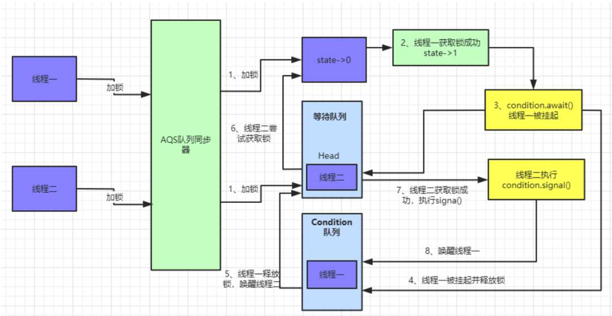

### 1、CAS操作

#### （1）简介

CAS（compareAndSwap）是一种无锁的非阻塞算法的实现，它是一条原子指令，乐观锁的使用的机制就是CAS。

#### （2）原理

在CAS方法中，CAS有三个操作数，内存值V，旧的预期值E，要修改的新值U。当且仅当预期值E和内存值V相等时，将内存值V修改为U，否则什么都不做。

#### （3）作用

于CAS是一种无锁的非阻塞的算法实现，所以在线程数不多（并发量小）的情况下，它的性能要比synchronized()要高得多，但是如果线程数过多（并发量大）就会过分的消耗CPU资源，这时采用加锁的方法保证线程安全会比较妥当。

例如AtomicInteger的原子类，底层调用的是Unsafe类里的方法，如下面的Add方法，倘若有多个线程都在修改同一个数据，频繁变化的数据会导致 **this.compareAndSwapInt(var1, var2, var5, var5 + var4)** 方法一直没成功而不断重试，进而不断消耗CPU资源。

```java
public final int getAndAddInt(Object var1, long var2, int var4) {
    int var5;
    do {
        var5 = this.getIntVolatile(var1, var2);
    } while(!this.compareAndSwapInt(var1, var2, var5, var5 + var4));

    return var5;
}
```

#### （4）ABA 问题与解决方法

- 问题描述：如果另一个线程修改V值假设原来是A，先修改成B，再修改回成A。当前线程的 CAS 操作无法分辨当前V值是否发生过变化。
- 解决方法：对内存中的值加个版本号，在比较的时候除了比较值以外，还比较版本号。Java中 AtomicStampedReference 就是用版本号实现 CAS 机制。

### 2、Synchronized锁

#### （1）简介

synchronized 是 Java 的一个关键字，用它来修饰代码块（方法），能够将代码块（方法）锁起来。

它主要作用是确保多个线程在同一个时刻，只能有一个线程处于方法或者同步块中。它保证了其他线程对变量的**可见性**（被修饰的代码块是一次性执行，没有其他线程同时访问）和线程对变量操作的**原子性**（执行完 synchronized 后，修改后的变量对其他线程可见），从而保证了并发下的线程安全。




<div align="center" style="font-size:12px">图4-1 synchronized 锁思维导图</div>

#### （2）特性

- 有序性：通过 as-if-serial 和 Happens-Before 规则来保证
- 可见性：强制工作内存刷新
- 原子性：单一线程持有
- 可重入性：JVM 程序计数器来记录重入次数
- 不可中断性：一个线程获取锁后，没获取锁的线程会一直处于阻塞或等待状态，不可被中断（Lock 的 tryLock 方法则可以被中断）

#### （3）原理

JVM 是通过进入、退出对象监视器（Monitor）来实现对方法、同步块的同步的。

具体实现是在编译之后在同步方法调用前加入一个 **monitorenter** 指令，在退出方法和异常处插入 **monitorexit** 的指令。

其本质就是对一个对象监视器 Monitor 进行获取，而这个获取过程具有排他性从而达到了同一时刻只能一个线程访问的目的。而对于没有获取到锁的线程将会阻塞到方法入口处，直到获取锁的线程 monitorexit 之后才能尝试继续获取锁。

如果是修饰代码块的话，Synchronized 底层是采用的就是上面这种方法，但如果是修饰方法的话，底层是采用方法修饰符上的**ACC_SYNCHRONIZED** 实现。

代码例子：

```java
public static void main(String[] args) {
    synchronized (Synchronize.class){
        System.out.println("Synchronize");
    }
}
```

例子对应的字节码：

```java
public class com.crossoverjie.synchronize.Synchronize {
  public com.crossoverjie.synchronize.Synchronize();
    Code:
       0: aload_0
       1: invokespecial #1                  // Method java/lang/Object."<init>":()V
       4: return

  public static void main(java.lang.String[]);
    Code:
       0: ldc           #2                  // class com/crossoverjie/synchronize/Synchronize
       2: dup
       3: astore_1
       **4: monitorenter**
       5: getstatic     #3                  // Field java/lang/System.out:Ljava/io/PrintStream;
       8: ldc           #4                  // String Synchronize
      10: invokevirtual #5                  // Method java/io/PrintStream.println:(Ljava/lang/String;)V
      13: aload_1
      **14: monitorexit**
      15: goto          23
      18: astore_2
      19: aload_1
      20: monitorexit
      21: aload_2
      22: athrow
      23: return
    Exception table:
       from    to  target type
           5    15    18   any
          18    21    18   any
}
```

**问题：为何解析出来的字节码中会有两个 monitorexit ？**

之所以会出现两个 monitorexit ，是因为同步代码块添加了一个隐式的 try-finally，为了防止因代码执行异常而出现死锁现象。

第一个 monitorexit 指令是正常释放锁的一个标志，若遇到了 Exception 或 Error 异常，则会调用第二个 monitorexit 指令来保证锁的释放，不会两个同时调用。

#### （4）锁优化

JDK 1.6 开始，JVM 对 Synchronized 做了各种优化，引入了偏向锁和轻量级锁，还做了适应自旋锁、锁消除和锁粗化等处理。

- **锁消除**：在编译期间有一种优化叫做逃逸分析，如果证明一个对象不会逃逸到方法外，即该对象不会被当前方法外的其他任何地方访问到，那么就可针对该对象进行优化

  ```java
  public class ClearLock {
      public void test() {
          Object obj = new Object();//对象无逃逸
          synchronized (new Object()) {//对象无逃逸，此处可以优化删除synchronized
          }
      }
  }
  ```

  

- **锁粗化**：如果发现有对同一对象连续的加锁、解锁操作，那么可将锁扩大到几步连续操作的最外面，即粗化锁的范围，借此减少多次加解锁带来的性能消耗。例如下面的方法 mthodA 可以被粗化成 mthodB 的样子

  ```java
  public Object methodA() {
      Object obj = new Object();
      synchronized (obj) {
          //do something 1
      }
      synchronized (obj) {
          //do something 2
      }
      return obj;
  }
  public Object methodB() {
      Object obj = new Object();
      synchronized (obj) {
          //do something 1
          //do something 2
      }
      return obj;
  }
  ```

synchronized 锁的升级完整流程图，如下所示



<div align="center" style="font-size:12px">图4-2 synchronized 锁升级流程图</div>

### 3、Lock 接口

#### （1）简介

在Lock接口出现之前，Java 程序是靠 synchronized 关键字实现锁功能的，而 JDK 1.5 之后，JUC 包中新增了 Lock 接口（以及相关实现类）用来实现锁功能。它提供了与 synchronized 关键字类似的同步功能，只是在使用时需要显式地获取和释放锁。

Lock 的常见实现类有重入锁（ReentrantLock）、读锁（ReadLock）、写锁（WriteLock），其底层基本都是依靠 AbstractQueuedSynchronized（简称 AQS ）的实现类来完成。

#### （2）特性

| 特性               | 描述                                                         |
| ------------------ | ------------------------------------------------------------ |
| 尝试非阻塞地获取锁 | 当前线程尝试获取锁，如果这一时刻锁没有被其他线程获取到，则成功获取并持有锁 |
| 能被中断地获取锁   | 与synchronized不同，获取到的锁能够响应中断，当获取到锁的线程被中断时，中断异常将会被抛出，同时锁会被释放 |
| 超时获取锁         | 在指定的时间截止之前获取锁，如果截止时间之前仍旧无法获取锁，则返回 |


### 4、队列同步器 AQS

#### （1）简介

Java并发包（JUC）中提供了很多并发工具，这其中，很多我们耳熟能详的并发工具，譬如 ReentrantLock、Semaphore，它们的实现都用到了一个共同的基类—— AbstractQueuedSynchronizer，简称 AQS 。

#### （2）实现原理

AQS 是一个用来构建锁和同步器的基础框架，它使用了一个 volatile int state 成员变量表示同步状态，通过内置的 FIFO 队列来完成资源获取线程的排队工作。

```java
private volatile int state;//共享变量，使用volatile修饰保证线程可见性
```

状态信息通过protected类型的 getState，setState，compareAndSetState 进行操作。

这里volatile能够保证多线程下的可见性，当 state=1 则代表当前对象锁已经被占有，其他线程来加锁时则会失败，加锁失败的线程会被放入一个FIFO的等待队列中，比列会被UNSAFE.park()操作挂起，等待其他获取锁的线程释放锁才能够被唤醒。



<div align="center" style="font-size:12px">图4-3 AQS的实现原理图</div>

#### （3）AQS支持的两种同步方式

独占式（非公平锁）：如 ReentrantLock

共享式（公平锁）：如 Semaphore、CountDownLatch

非公平锁和公平锁的区别：非公平锁性能高于公平锁性能。非公平锁可以减少CPU唤醒线程的开销，整体的吞吐效率会高点，CPU也不必取唤醒所有线程，会减少唤起线程的数量

非公平锁性能虽然优于公平锁，但是会存在导致线程饥饿的情况。在最坏的情况下，可能存在某个线程一直获取不到锁。不过相比性能而言，饥饿问题可以暂时忽略，这可能就是 ReentrantLock 默认创建非公平锁的原因之一了。


### 5、重入锁ReentrantLock

#### （1）简介

重入锁 ReentrantLock，顾名思义，就是支持重进入的锁，它表示该锁能够支持一个线程对资源的重复加锁。除此之外，该锁的还支持获取锁时的公平和非公平性选择。

#### （3）ReentrantLock与Synchronized的区别



<div align="center" style="font-size:12px">图4-4 ReentrantLock与Synchronized的区别图</div>

### 6、读写锁

#### （1）简介

ReentrantLock 和 synchronized 都是排它锁，这些锁在同一时刻只允许一个线程进行访问，而读写锁在同一时刻可以允许多个读线程访问，在写线程访问的时候其他的读线程和写线程都会被阻塞。

读写锁维护一对锁(读锁和写锁)，通过锁的分离，使得并发性提高。

#### （2）特性

- 公平性选择：支持非公平（默认）和公平的锁获取方式，对于二者而言，非公平锁的吞吐量要优于公平锁
- 可重入：读线程获取读锁之后能够再次获取读锁；写线程获取写锁之后能再次获取写锁，也可以获取读锁
- 锁能降级：遵循获取写锁、获取读锁在释放写锁的顺序，即写锁能够降级为读锁，但不支持锁升级


### 7、LockSupport

#### （1）简介

LockSupport 类，是 JUC 包中的一个工具类，是用来创建锁和其他同步类的基本线程阻塞，底层依赖于 Unsafe 类实现。

LockSupport类的核心方法是 park() 和 unpark()，其中 park() 方法用来阻塞当前调用线程，unpark() 方法用于唤醒指定线程。

#### （2）解析

每个使用 LockSupport 的线程都会与一个许可（permit）关联，如果该许可可用，则调用 park() 将会立即返回。如果许可尚不可用，则可以调用 unpark() 使其可用，否则可能阻塞。

调用 park() 后会阻塞当前线程，但以下三种情况都可以解除阻塞，令其继续执行：

- 其他线程将当前线程作为目标调用 unpark()
- 其他线程中断当前线程 interrupt()
- 该调用不合逻辑（毫无理由）地返回

### 8、Condition接口

#### （1）简介

Condition 是在 Java 1.5 才出现的，它用来替代传统的Object的wait()、notify()实现线程间的协作。相比使用Object的wait()、notify()，使用 Condition 中的await()、signal()这种方式实现线程间协作更加安全和高效，因此通常来说比较推荐使用 Condition。

Condition 主要与 Lock 进行配合，获取一个 Condition 对象需要调用 Lock 的 newCondition 方法或得 ConditionObject，是AQS的一个内部类。

#### （2）实现原理与案例

一个线程获取锁后，通过调用Condition的await()方法，会释放锁，然后构造成节点并将节点从尾部加入等待队列,并进入等待状态。

当线程调用 signal() 方法后，程序首先检查当前线程是否获取了锁，然后通过 doSignal(Node first) 方法唤醒同步队列的等待时间最长的节点（首节点)。在唤醒节点之前，会将节点移动到同步队列中，被唤醒的线程，将从 await() 方法中的while循环中退出来，然后调用 acquireQueued() 方法竞争同步状态。

示例代码：

```java
/**
 * ReentrantLock 实现源码学习
 * @author 一枝花算不算浪漫
 * @date 2020/4/28 7:20
 */
public class ReentrantLockDemo {
    static ReentrantLock lock = new ReentrantLock();

    public static void main(String[] args) {
        Condition condition = lock.newCondition();

        new Thread(() -> {
            lock.lock();
            try {
                System.out.println("线程一加锁成功");
                System.out.println("线程一执行await被挂起");
                condition.await();
                System.out.println("线程一被唤醒成功");
            } catch (Exception e) {
                e.printStackTrace();
            } finally {
                lock.unlock();
                System.out.println("线程一释放锁成功");
            }
        }).start();

        new Thread(() -> {
            lock.lock();
            try {
                System.out.println("线程二加锁成功");
                condition.signal();
                System.out.println("线程二唤醒线程一");
            } finally {
                lock.unlock();
                System.out.println("线程二释放锁成功");
            }
        }).start();
    }
}
```

执行效果如下：



<div align="center" style="font-size:12px">图4-5 Condition示例代码执行结果图</div>

代码执行流程如下：



<div align="center" style="font-size:12px">图4-6 Condition示例代码执行流程图</div>

#### （3）Condition 与 await/notify 的比较

- Condition 可以精准的对多个不同条件进行控制，wait/notify 只能和 synchronized 关键字一起使用，并且只能唤醒一个或者全部的等待队列；
- Condition 需要使用 Lock 进行控制，使用的时候要注意 lock() 后及时的unlock()，Condition 有类似于 await 的机制，因此不会产生加锁方式而产生的死锁出现，同时底层实现的是 park/unpark 的机制，因此也不会产生先唤醒再挂起的死锁，一句话就是不会产生死锁，但是 wait/notify 会产生先唤醒再挂起的死锁。


------

[^synchronized 引用与补充]: https://mp.weixin.qq.com/s/2ka1cDTRyjsAGk_-ii4ngw

[^ AQS、ReentrantLock、Conditon引用出处]:  https://mp.weixin.qq.com/s/trsjgUFRrz40Simq2VKxTA

