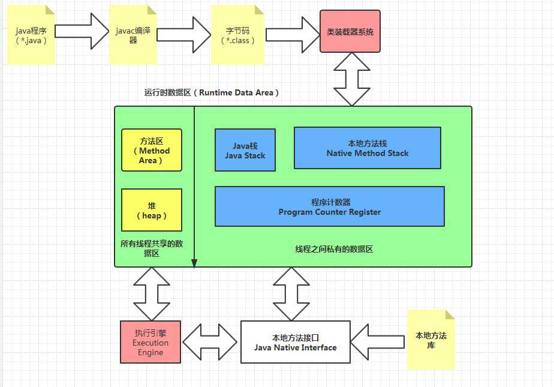

## 运行时数据区域

### Java堆
1. Java堆是JVM所管理的内存中最大的一块，属于线程共享的内存
2. 该内存的唯一目的就是存放对象实例，几乎所有的对象实例和数据都要在堆上分配内存
3. Java堆是垃圾收集器管理的主要区域，有时候也被称之为GC堆（Garbage Collected Heap）
4. 如果在堆中没由内存完成实例分配，并且堆也无法扩展时，会抛出OutOfMemoryError异常

### 方法区
1. 用于存储已被虚拟机加载的类信息、常量、静态变量、即时编译器（JIT）编译后的代码等数据，属于线程共享的内存
2. 它与”永久代“并不等价，方法区是一种规范、标准，而永久代只是HotSpot垃圾收集器的一种实现，在JDK1.8后，永久代被从方法区中去掉，取而代之的是元空间
3. 当方法区无法满足内存分配时，会抛出OutOfMemoryError异常

### 运行时常量池
1. 运行时常量池是方法区的一部分，属于线程共享的内存
2. Class文件常量池用于存放编译期间生成的各种字面量和符号引用，它会在类加载后进入方法区的运行时常量池中存放，一个类加载对应一个运行时常量池
3. 运行时常量池相对于Class文件常量池来说具备动态性，除了预置的内容，在运行期间产生的新常量也能放入池中

### 程序计数器
1. 可看作是当前线程所执行的字节码的行号指示器，为线程切换提供保障，属于线程私有的内存
2. 若线程正在执行一个Java方法，则计数器会记录正在执行的虚拟机字节码指令的地址，若执行的是Native方法，则该计数器为空（Undefined）
3. 该区域是Java虚拟机规范中没有规定任何OutOfMemoryError情况的区域

### Java虚拟机栈
1. 虚拟机栈描述的是Java方法执行的内存模型，生命周期与线程相同，属于线程私有的内存
2. 栈帧用于存储局部变量表、操作数栈、动态链接、方法出口等信息，每个方法从调用到执行完成的过程，都对应着一个栈帧在虚拟机栈中由入栈到出栈的过程
3. 局部变量表存放了编译期可知的各种基本数据类型、对象引用和returnAddress类型，所需空间会在编译期间完成分配
4. 该区域规定了两种异常状况，如果线程请求的栈深度大于虚拟机所允许的深度，则抛出StackOverflowError异常；若虚拟机栈动态扩展（大部分JVM允许扩展，也可设置不扩展）时无法申请到足够的内存，则抛出OutOfMemoryError异常

### 本地方法栈
1. 本地方法栈于虚拟机栈所发挥的作用差不多，属于线程私有的内存
2. 虚拟机栈为虚拟机执行Java方法服务，本地方法栈为虚拟机用到的Native方法服务
3. 抛出异常于虚拟机栈一样，StackOverflowError异常和OutOfMemoryError异常

## 直接内存
1. 直接内存既不是虚拟机运行时数据区的一部分，也不是Java虚拟机规范中定义的内存区域，它是Java堆外内存
2. 本机直接内存的分配不会受到Java堆大小的限制，但它还是内存，仍然会受到本机总内存以及处理器寻址空间的限制，当服务器管理员在配置虚拟机参数时粗心大意，使得各个内存区域总和大于物理内存限制，就会导致动态扩展时出现OutOfMemoryError异常