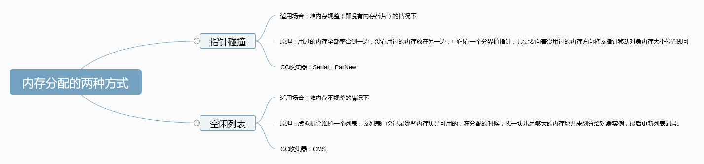
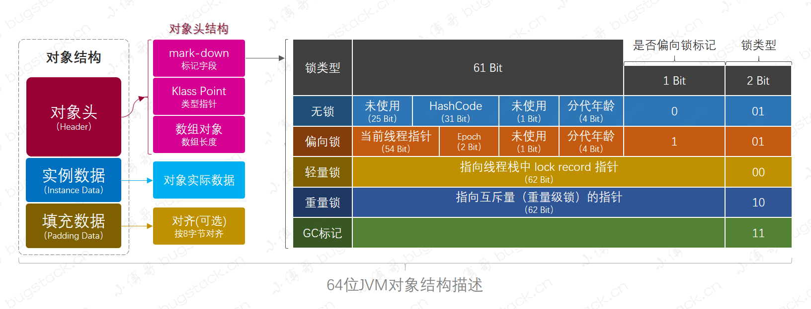
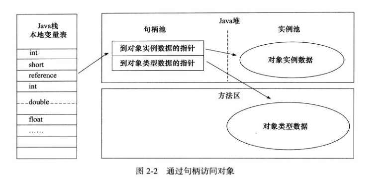
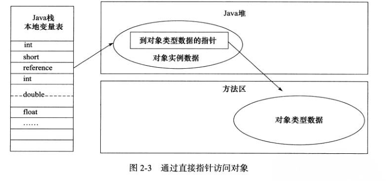

## 对象的创建
### 1.使用指令创建对象

​		创建对象有多种方法，最常见的便是用New关键字创建对象，除此之外还可以使用反射机制（Class类的newInstance、使用Constructor类的newInstance方法）、Clone方法、反序列化等方式创建对象。

​		由类加载器负责根据一个类的全限定名来读取此类的二进制字节流到JVM内部，并存储在运行时内存区的方法区，然后将其转换为一个与目标类型对应的java.lang.Class对象实例。

​		

```java
public class Student implements Cloneable, Serializable {
    private int id;
    public Student() {}
    public Student(Integer id) {this.id = id;}

    @Override
    protected Object clone() throws CloneNotSupportedException {
        // TODO Auto-generated method stub
        return super.clone();
    }

    @Override
    public String toString() {return "Student [id=" + id + "]";}

    public static void main(String[] args) throws Exception {

        // 使用new关键字创建对象
        Student stu1 = new Student(123);

        // 使用Class类的newInstance方法创建对象
        // 对应类必须具有无参构造方法，且只有这一种创建方式
        Student stu2 = Student.class.newInstance();    

        // 使用Constructor类的newInstance方法创建对象
        Constructor<Student> constructor = Student.class
                .getConstructor(Integer.class);   // 调用有参构造方法
        Student stu3 = constructor.newInstance(123);   

        // 使用Clone方法创建对象
        Student stu4 = (Student) stu3.clone();

        // 使用(反)序列化机制创建对象
        // 写对象
        ObjectOutputStream output = new ObjectOutputStream(
                new FileOutputStream("student.bin"));
        output.writeObject(stu4);
        output.close();
        // 读取对象
        ObjectInputStream input = new ObjectInputStream(new FileInputStream(
                "student.bin"));
        Student stu5 = (Student) input.readObject();
    }
}
```

### 2.类加载检查
​		根据new的参数检查能否在常量池中定位到一个类的符号引用（即类的带路径全名），并且检查这个符号引用代表的类是否已被加载、解析和初始化过，即该类有没被加载到方法区

### 3.类加载
​		若找不到相应的符号引用，即该类没被加载到方法区，则先进行类加载，若该类已被加载过，则继续

### 4.分配内存
- 获取被加载类的对象所需内存大小（类加载后便可获知）
- 检查是否在TLAB中分配内存，若是则在TLAB中分配内存，否则就在Eden中分配内存（少数情况下也可能会直接分配给老年代中，例如大对象就直接进入老年代）

### 5.初始化零值
​		将分配到的空间全部初始化为零值（不包括对象头），例如int=0  string=null boolean=false，目前用户设定的初始值还未执行

### 6.设置对象头信息
​		初始化零值完成之后，虚拟机要对对象进行必要的设置，例如这个对象是那个类的实例、如何才能找到类的元数据信息、对象的哈希码、对象的 GC 分代年龄等信息，这些信息存放在对象头（Object Header）中。另外，根据虚拟机当前运行状态的不同，如是否启用偏向锁等，对象头会有不同的设置方式。

### 7.执行init方法
​		执行完上面的步骤之后，从虚拟机来看已经创建成功了，但对于Java程序而言还未真正完成，还需要调用init方法，把对象按照程序员的意愿去分配初始值，这样一个真正可用的对象才算创建完成

- 如果对象是通过 clone() 方法创建的，那么 JVM 把原来被克隆的对象的实例变量的值拷贝到新对象中；
- 如果对象是通过 ObjectInputStream 类的 readObject() 方法创建的，那么 JVM 通过从输入流中读入的序列化数据来初始化那些非暂时性(non-transient)的实例变量；
- 如果实例变量在声明时被显式初始化，那么就把初始化值赋给实例变量，接着再执行构造方法。这是最常见的初始化对象的方式。


## 对于内存分配的两种方式



<div align="center" style="font-size:12px">图2-1 内存分配的两种方式</div>

## 对于内存分配的并发问题

### 两种保障方式
​		在创建对象的时候有一个很重要的问题，就是线程安全，因为在实际开发过程中，创建对象是很频繁的事情，作为虚拟机来说，必须要保证线程是安全的，通常来讲，虚拟机采用两种方式来保证线程安全：
#### 1、CAS+失败重试 
CAS是乐观锁的一种实现方式。所谓乐观锁就是，每次不加锁而是假设没有冲突而去完成某项操作，如果因为冲突失败就重试，直到成功为止。虚拟机采用 CAS 配上失败重试的方式保证更新操作的原子性。
#### 2、TLAB
为每一个线程预先在 Eden 区分配一块儿内存，JVM 在给线程中的对象分配内存时，首先在 TLAB 分配，当对象大于 TLAB 中的剩余内存或 TLAB 的内存已用尽时，再采用上述的 CAS 进行内存分配

#### 3、关于TLAB的补充说明
&emsp;&emsp;JVM在内存新生代Eden Space中开辟了一小块线程私有的区域，称作TLAB（Thread-local allocation buffer，线程本地分配缓存区）。默认设定为占用Eden Space的1%。在Java程序中很多对象都是小对象且用过即丢，它们不存在线程共享也适合被快速GC，所以对于小对象通常JVM会优先分配在TLAB上，并且TLAB上的分配由于是线程私有所以没有锁开销。因此在实践中分配多个小对象的效率通常比分配一个大对象的效率要高。

&emsp;&emsp;也就是说，Java中每个线程都会有自己的缓冲区称作TLAB（Thread-local allocation buffer），每个TLAB都只有一个线程可以操作，TLAB结合bump-the-pointer技术可以实现快速的对象分配，而不需要任何的锁进行同步，也就是说，在对象分配的时候不用锁住整个堆，而只需要在自己的缓冲区分配即可。

## 对象的内存布局

### 1.对象头
​		Hotspot 虚拟机的对象头包括两部分信息，第一部分用于存储对象自身的自身运行时数据（哈希码、GC 分代年龄、锁状态标志、线程持有的锁、偏向线程ID、偏向时间戳等等），这部分数据称为“Mark Word“；另一部分是Class对象的类型指针（Klass Pointer），即对象指向它的类元数据的指针，虚拟机通过这个指针来确定这个对象是哪个类的实例。



<div align="center" style="font-size:12px">图2-2 64位JVM对象结构描述</div>

### 2.实例数据

&emsp;&emsp;实例数据部分是对象真正存储的有效信息，也是在程序中所定义的各种类型的字段内容。

### 3.对齐填充
&emsp;&emsp;对齐填充部分不是必然存在的，也没有什么特别的含义，仅仅起占位作用。 因为 Hotspot 虚拟机的自动内存管理系统要求对象起始地址必须是8字节的整数倍，换句话说就是对象的大小必须是8字节的整数倍。而对象头部分正好是8字节的倍数（1倍或2倍），因此，当对象实例数据部分没有对齐时，就需要通过对齐填充来补全。

## 对象的访问定位
&emsp;&emsp;建立对象就是为了使用对象，我们的 Java 程序通过栈上的 reference 数据来操作堆上的具体对象。对象的访问方式有虚拟机实现而定，目前主流的访问方式有两种。

### 1.使用句柄
​		如果使用句柄的话，那么 Java 堆中将会划分出一块内存来作为句柄池，reference 中存储的就是对象的句柄地址，而句柄中包含了对象实例数据与类型数据各自的具体地址信息

​		使用句柄的好处：reference 中存储的是稳定的句柄地址，在对象被移动时（GC时很普遍会移动对象）只会改变句柄中的实例数据指针，而 reference 本身不需要修改




### 2.使用直接指针 
​		如果使用直接指针访问，那么 Java 堆对象的布局中就必须考虑如何放置访问类型数据的相关信息，而栈帧中的 reference 存储的直接就是对象的地址

​		使用直接指针的好处：访问速度快，它节省了一次指针定位的时间开销。

​		HotSpot虚拟机主要就是使用这种方式进行对象访问，但从整个软件开发的范围来看，在各种语言、框架中使用句柄访问的情况也十分常见。

 

