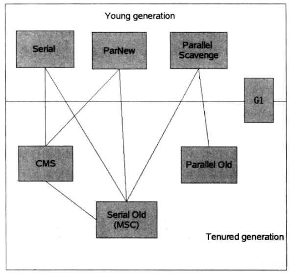

### 一、回收机制算法
#### 1、引用计数算法
&emsp;&emsp;概念：给对象添加一个引用计数器，每当对象被引用一次，计数器就加1， 当引用失效时，计数器值减1，当计数器为0时，则表示该对象可以被回收 
&emsp;&emsp;结果：没被主流采用，因为两个对象相互引用的话，会造成无法回收的死循环

#### 2、可达性算法
&emsp;&emsp;概念：从GC Root作为起点开始搜索，当一个对象到GC Root没有任何引用链相连，即该对象到GC Roots不可达时，该对象便可以被GC回收

&emsp;&emsp;GC Roots的对象：
&emsp;&emsp;1.虚拟机栈（栈帧中的本地变量表）中引用的对象
&emsp;&emsp;2.方法区中静态属性引用的对象
&emsp;&emsp;3.方法区中常量引用的对象
&emsp;&emsp;4.本地方法栈中JNI（即一般说的Native方法）引用的对象

### 二、Java的四种引用
1. 强引用：类似于A a = new A()这类引用，只要强引用还存在，GC永远不会回收这类对象的内存
2. 软引用：系统将要发生内存溢出异常之前，GC会将这类对象回收
3. 弱引用：每当GC工作时，无论当前内存是否足够，这类对象都会被回收
4. 虚引用：最弱的引用，和没有引用差不多，并且随时可能被回收。为一个对象设置虚引用关联的唯一目的就是能在这个对象被GC回收时收到一个系统通知

### 三、存活依据
1. 进行可达性算法后发现并没有与GC Roots相连接的引用链，会被第一次标记并进行一次筛选
2. 若对象没有覆盖finalize()方法或者finalize()方法已被虚拟机调用过，则会被视为“没有必要执行”
3. 若该对象被判断为有必要执行finalize()方法，则该对象会被放置于名为F-Queue（即将回收）的队列中，等待执行finalize()方法
4. 稍后GC会对F-Queue队列中的对象进行第二次小规模标记，倘若对象没在finalize()方法中重新连上GC Roots的引用链，那它就会被回收

> 注意：任何一个对象的finalize()方法都只会被调用一次，第一次要被回收时系统会去自动调用，可以看成是一次自救

### 四、垃圾收集算法
#### 1、标记-清除算法
&emsp;&emsp;首先标记出所有需要回收的对象，标记完成后再统一回收所有被标记的对象
&emsp;&emsp;它是最基础的收集算法，主要不足有两个，一是标记和清理的效率都不高，另一个是会产生大量不连续的内存碎片

#### 2、复制算法
&emsp;&emsp;将内存分为大小相等的两部分，每次只使用其中一部分，倘若将这两部分看做A和B，则当A内存用完时，就会将存活对象复制到B内存上，再把A内存一次性全部清理掉
&emsp;&emsp;优点：每次都是对整个半区进行内存回收，不会出现内存碎片的情况
&emsp;&emsp;缺点：可用内存只剩下原来的一半，代价太高了

#### 3、标记-整理算法
&emsp;&emsp;标记过程跟“标记-清除算法”一样，但标记后会将所有存活对象向着同一端移动，然后直接清理掉端边界以外的内存

#### 4、分代算法
&emsp;&emsp;根据对象存活周期的不同将内存分为好几块，一般是将Java堆分为新生代和年老代，再根据各自年代的特点去使用不同的收集算法

### 五、垃圾收集器

#### 1、Serial收集器
新生代GC，单线程，采用复制算法，进行垃圾收集时会“Stop The World”
#### 2、ParNew收集器
新生代GC，Serial的多线程版本，一样采用复制算法，一样会STW
#### 3、Parallel Scavenge
新生代GC，多线程，采用复制算法，它的目标是达成一个可控的吞吐量
#### 4、Serial Old收集器
老年代GC，单线程，采用标记-整理算法，可作为CMS收集器的后备预案
#### 5、Parallel Old收集器
老年代GC，多线程，采用标记-整理算法，JDK1.6后多用来替代Serial Old
#### 6、CMS收集器
老年代GC，并发收集，采用标记-清除算法，以获取最短停顿为目的，但需要更多内存
#### 7、G1收集器
老年代+新生代GC，能并行与并发，采用分代收集算法，可实现可预测的停顿

> 关于GC收集器的详细内容可前往：https://www.cnblogs.com/cxxjohnson/p/8625713.html

### 六、内存分配和回收策略
#### 1. 对象优先在新生代的Eden区分配
#### 2. 大对象会直接进入老年代
&emsp;&emsp;-XX:PretenureSizeThreshold（可设置大于该参数的直接分配到老年代）
#### 3. 长期存活对象将进入老年代
&emsp;&emsp;对于Survivor区中的对象，每经历过一次Minor GC，相应年龄就会增加一岁 &emsp;&emsp;-XX:MaxTenuringThreshold（一般默认为15，大于该参数的会被晋升到老年代）
#### 4. 动态对象年龄判定
&emsp;&emsp;其实不一定要年龄大于上面那个参数才能晋升老年代，只要在Survivor空间中相同年龄所有对象大小的总和大于Survivor空间的一半，那么大于或等于该年龄的对象都能直接进入老年代
#### 5. 空间分配担保
&emsp;&emsp;在发生Minor GC之前，虚拟机会先检查老年代最大可用的连续空间是否大于新生代所有对象大小总和，若该条件成立，才能放心去Minor GC，若不成立，则虚拟机会查看HandlePromotionFailure设置值是否允许担保失败，若允许，则会继续检查老年代最大可用的连续空间是否大于历次晋升到老年代对象的平均大小，若大于，才尝试去进行一次Minor GC，并且该Minor
GC还存在风险；倘若小于，或HandlePromotionFailure设置不允许冒险，那就应该改为进行一次Full GC（为了避免Full GC过多，一般该参数会设置为打开状态）
&emsp;&emsp;在JDK 6 Update 24之后，简化为发生Minor GC前检查老年代最大可用的连续空间是否大于新生代所有对象总大小或者历次晋升的平均大小，若大于则Minor GC，否则就Full  GC

### 七、Minor GC、Major GC、Full GC之间的区别
> 这部分直接放地址了：https://www.cnblogs.com/tuhooo/p/7508503.html