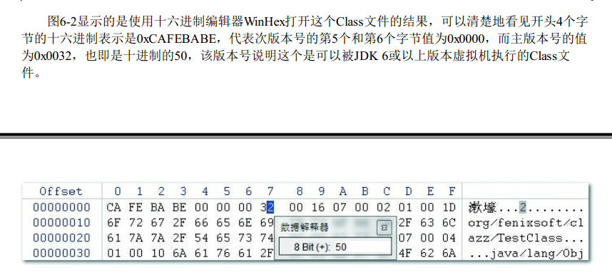
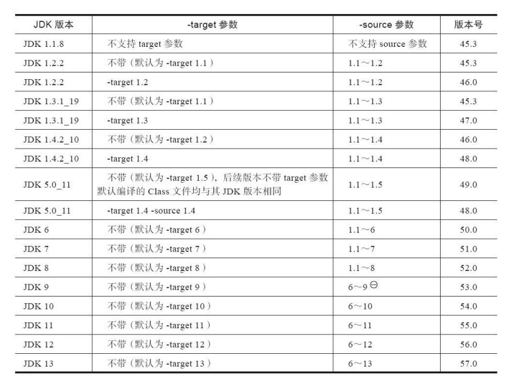

#### 1、魔数（Magic Number）

​		前4个字节被称之为魔数，用于确定该文件是否为一个能被虚拟机接受的class文件

​		class文件的魔数为0xCAFEBABE（咖啡宝贝）

#### 2、文件版本（Version）

​		第5、6个字节为次版本号，第7、8个字节为主版本号

​		下图为class文件版本号

#### 3、常量池（Constant Pool）

​		常量池入口，常量池主要存放字面量和符号引用

​		字面量：比较接近于Java语言层面中的常量概念，如文本字符串、申明为final的常量值等

​		符号引用：比较接近于编译原理方面的概念，主要包括类和接口的全限定名、字段的名称与描述符、方法的名称和描述符

​		常量池分析：https://blog.csdn.net/gcw1024/article/details/51026840

#### 4、访问标志（Access Flags）

​		紧接着的两个字节表示访问标志，例如该class文件是类还是接口、是否是public、是否是abstract等等

#### 5、索引（Index）

​		类索引、父类索引、接口索引集合，三个都是u2（2个字节的无符号数）类型，这三项数据共同确定一个类的继承关系

#### 6、字段表集合（Field Info）

​		字段表，用于描述接口或者类中声明的变量，例如作用域（public、private……）、是实例变量还是类变量（static）、可变性（final）、并发可见性（volatile）、字段数据类型（基本类型、对象、数组）。

​		字段包括类级变量以及实例级变量，但不包括方法内部声明的局部变量

#### 7、方法表集合

​		Class文件存储格式中对方法的描述和字段表几乎一致

​		在Java语言中，要重载一个方法，除了要跟原方法具有相同的简单名称外，还必须要有一个与原方法不同的特征签名，特征签名就是一个方法中各个参数在常量池中的字段符号的集合，也就是因为返回值不会包含在特征签名中，因此Java语言里面是无法仅仅依靠返回值的不同来进行方法重载。

​		但在Class文件中，特征签名的范围要更大些，只要描述符不是完全一致就可以共存，就是说如果两个方法有相同的名称和特征签名，但返回值不同，那么它们还是可以合法共存于同一Class文件当中

#### 8、属性表集合

​		在Class文件、字段表、方发表都可以携带自己的属性表集合