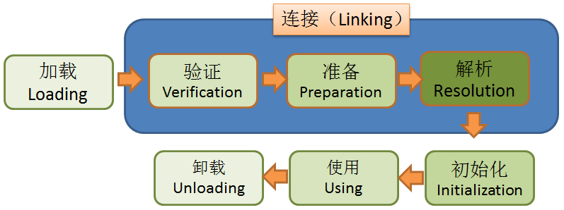
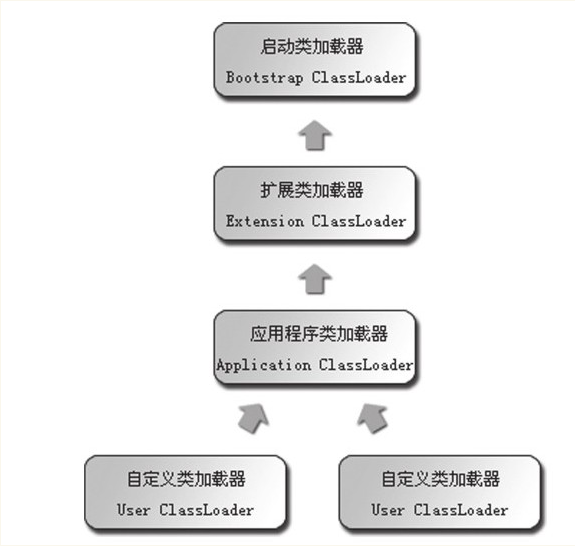
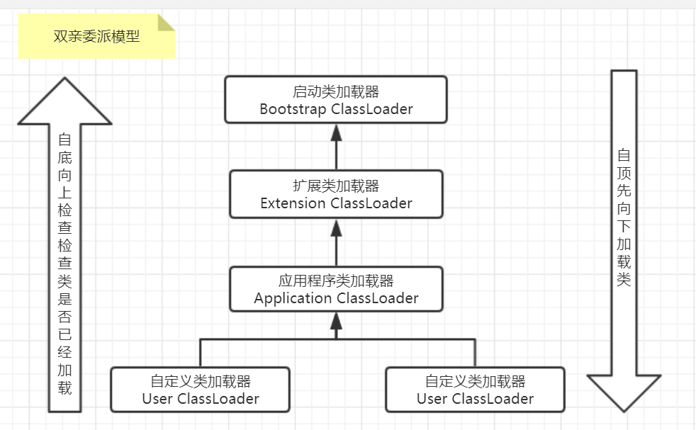

## 一、类的生命周期


<div align="center" style="font-size:12px">图5-1 Java类的生命周期</div>

​		注意：解析阶段不一定按照顺序来执行，它可以在初始化阶段之后再开始，这是为了支持Java语言的运动时绑定	（也称之为动态绑定或晚期绑定）

## 二、类的初始化

### 有 6 种情况会触发类的初始化
1. 遇到new、getstatic、putstatic或invokestatic这4条字节码指令
2. 使用java.lang.reflect包的方法对类进行反射调用的时候
3. 当初始化一个类的时候，若发现其父类还未初始化，则需先触发父类的初始化
4. 当虚拟机启动时，用户需要指定一个要执行的主类（即包括main方法的那个类），虚拟机会先初始化这个类
5. 当使用JDK 7 的动态语言支持时，如果一个java.lang.invoke.MethodHandle实例最后的解析结果REF_getStatic、REF_putStatic、REF_invokeStatic的方法句柄，并且该方法句柄所对应的类没有进行过初始化，则需要先触发其初始化
6. 当一个接口中定义了JDK 8 新加入的默认方法（被default关键字修饰的接口方法）时，如果有该接口的实现类发生了初始化，那该接口要在其之前被初始化

### 不会触发类初始化的情况
1. 通过子类引用父类的静态字段，只会触发父类的初始化而不会导致子类被初始化，至于会不会触发子类的加载和验证，这个要取决于虚拟机的具体实现
2. 通过数组定义来引用类，不会触发此类的初始化，例如 Test[] test = new Test[450]
3. 引用一个类的常量也不会触发类的初始化，因为常量在编译阶段会存入调用类的常量池中，本质上并没有直接引用到定义常量的类

## 三、生命周期具体过程

### 1、加载
​		该阶段虚拟机要完成三件事
1. 通过一个类的全定名来获取定义此类的二进制字节流（不一定要从一个Class文件中获取，也可以从ZIP包、网络、动态生成、数据库等渠道获取）
2. 将这个字节流的二进制内容加载到虚拟机的方法区
3. 在内存中生成一个java.lang.Class对象，作为方法区这个类的各种数据的访问入口

&emsp;&emsp;相对于类加载的其他阶段而言，加载阶段（准确地说，是加载阶段获取类的二进制字节流的动作）是可控性最强的阶段，因为开发人员既可以使用系统提供的类加载器来完成加载，也可以自定义自己的类加载器来完成加载。

> 注意：加载阶段与连接阶段的部分内容（如一部分字节码文件格式验证动作）是交叉进行的，加载阶段尚未完成，连接阶段可能就开始了，但这些夹在加载阶段之中进行的动作，仍然属于连接阶段的内容，这两个阶段的开始时间仍然保持着固定的先后顺序
>

### 2、验证
​	该阶段主要包括以下4个阶段，目的是为了验证Class文件的二进制内容对于虚拟机来说是否合法、安全。
- **文件格式验证**，确保字节流符合Class文件格式的规范并且能被当前版本的JVM处理。

  例如：验证魔数、验证主次版本号、检查常量tag标志等等

- **元数据验证**，主要进行语义校验，确保字节码的语义描述符合《Java语言规范》。

  例如：该类是否有父类、是否错误继承了final类、是否实现了其父类或接口要求的所有方法等等

- **字节码验证**，主要通过数据流和控制流分析，确保程序语义合法且符合逻辑，以及确保类的方法体在运行时不会做出危害JVM安全的行为。

  例如：验证类型转换是否合法、保证任意时刻栈帧的数据类型与指令代码序列都能配合工作（例如不会出现类似于“在栈帧放置了个int类型的数据，使用时却按照long类型来加载到本地变量表里”）等等

- **符号引用验证**，发生于虚拟机将符号引用转化为直接引用的时候（转换动作发生在解析阶段）。

  例如：验证引用的类是否存在，验证引用的成员变量、类、方法是否能被当前类访问等等。

  

​	该验证的主要目的是为了确保解析行为能够正常执行，若无法通过符号引用验证，可能会抛出java.lang.IncompatibleClassChangeError异常的子类，如java.lang.IllegalAccessError、java.lang.NoSuchFieldError、java.lang.NoSuchMethodError等

### 3、准备

该阶段会正式为类成员变量（即static成员变量）分配内存，并将它们的初始值设置为默认值


```
public static int a = 123;
```

例如上述的类变量定义，在准备阶段后，a在内存中的值仍然为0，赋予123这个行为是在初始化
阶段才执行的

数据类型 | 零值 | 数据类型 | 零值 |
---|---|---|---|
int | 0 | boolean | false
long | 0L | float| 0.0f
short| (short)0| double| 0.0d
char |'\u0000'| reference| null
byte| (byte)0  

上面该表格为Java基本数据类型的零值，不过只要类字段的字段属性表中存在ConstantValue属性，那即使在准备阶段，该类变量也能初始化为指定的值

```
public static final int a = 123;
```

例如这次的a被final修饰符所修饰，变成一个常量，那在准备阶段完成时，它就不是0而是123了

### 4、解析
&emsp;&emsp;虚拟机会将常量池内的符号引用替换为直接引用，该解析主要针对的是类或接口、字段、类方法、接口方法、方法类型、方法句柄和调用点限定符7类符号引用。

​		虚拟机规范之中并没有规定解析阶段的具体发生时间，也就是说，在转换成直接引用后，可以触发校验阶段的符号引用验证，从这也能看出来类加载的各个阶段在实际进行时可能是交错执行的

### 5、初始化
​		初始化阶段会开始在内存中构造一个Class对象来表示该类，即执行类构造器<clinit>()方法的过程需注意的是，<clinit>()方法跟<init>()方法并不相同

- <clinit>()方法中执行的是对所有类变量的赋值动作和静态语句块(static{}块)中的语句合并操作，并且编译器收集的顺序是由语句在源文件中出现的顺序决定的
- 虚拟机会确保先执行父类的<clinit>()方法，因此第一个被执行的类肯定是java.lang.Object，并且父类中定义的静态语句块要优先于子类的变量赋值操作
- 如果一个类中没有static语句块，也没有对类变量的赋值操作，那该类就不会生成<clinit>()方法
- 接口中不能使用静态代码块，但仍然有变量初始化的赋值操作，因此接口与类一样都会生成<clinit>()方法，但接口与类不同的是，执行接口的<clinit>()方法不需要先执行父接口的<clinit>()方法，因为只有当父接口中定义的变量被使用时，父接口才会被初始化。此外，接口的实现类在初始化时也一样不会执行接口的<clinit>()方法。
- 虚拟机会保证<clinit>()方法的执行在多线程中是安全的，如果多个线程去同时初始化一个类，那么只有一个线程会去执行该类的<clinit>()方法，其他线程都要阻塞等待

## 四、Java类加载器

### 1、含义
​		类加载器（class loader）是用来将Java类加载到虚拟机中的代码模块，加载一个Class文件首先需要获取该Class的二进制字节流，这个过程可以通过自定义类加载器来实现，从而可以通过多种灵活的途径获取Class的二进制字节流。

### 2、确定唯一性
​		每个加载器都有各自独立的类名称空间，一个类的唯一性要通过其类加载器来确定。判断两个类是否相等，只有这两个类是由同一个类加载器加载的前提下才有意义，否则，即使两个类来自于同一个Class文件，被同一个虚拟机加载，只要加载它们的类加载器不同，那这两个类就不相同

### 3、类加载器的主要类型

- 启动类加载器（Bootstrap ClassLoader）
该加载器使用C++语言实现，是虚拟机自身的一部分，主要作用是加载<JAVA_HOME>\lib目录中的系统类库（如.rt.jar）
- 扩展类加载器（Extension ClassLoader）
该加载器由sun.misc.Launcher$ExtClassLoader实现，负责加载<JAVA_HOME>\lib\ext目录中的，或者被java.ext.dirs系统变量所指定的路径中的所有类库
- 应用程序类加载器（Application ClassLoader）
该加载器由sun.misc.Launcher$AppClassLoader实现，负责加载用户类路径（ClassPath）上所指定的类库，若应用程序没有自定义过自己的类加载器，一般情况下这个就是程序中默认的类加载器

### 4、双亲委派模型


<div align="center" style="font-size:12px">图5-2 双亲委派模型</div>

​		双亲委派模型要求除了顶层的启动类加载器外，其余的类加载器都应该有自己的父类加载器。这里类加载器之间的父子关系一般不会以继承的关系来实现，而是用组合关系来复用父类加载器的代码

​		每个类加载器都有自己的加载缓存，当一个类被加载后就会放入缓存，等下次加载时会直接从缓存中返回。

​		工作流程：当一个类加载器去加载一个Class时，它会先委派自己的父类加载器去加载，每层都是这样，因此所有的加载器请求最终都应该传到顶层的启动类加载器中，只有父类加载器无法加载时，子类才会尝试自己去加载，并将其放进自己的缓存中。

​		因此，加载过程可以看成自底向上检查类是否已经加载，然后自顶向下加载类，如下图所示。



<div align="center" style="font-size:12px">图5-3 双亲委派模型的加载过程</div>

​		好处：双亲委派模型可以保证重要的系统Class始终由启动类加载器加载，确保Java运行环境的稳定性和正确性，避免用户自己编写的类动态替换 Java 的一些核心类（比如 String类）同时也避免了重复加载，因为 JVM 中区分不同类，不仅仅是根据类名，相同的 class 文件被不同的 ClassLoader 加载就是不同的两个类，如果相互转型的话会抛java.lang.ClassCaseException

参考自：
https://www.cnblogs.com/jqctop1/ 
https://www.cnblogs.com/bokeyuanlongbin/p/9071629.html 
《深入理解Java虚拟机》