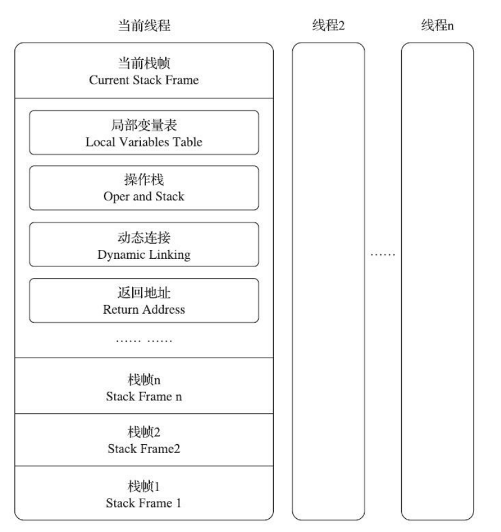
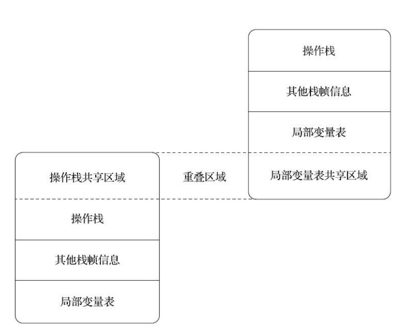

**1、含义**

JVM以方法作为最基本的执行单元，“栈帧”（Stack Frame）则是用于支持JVM进行方法调用和方法执行背后的数据结构，它也是JVM运行时数据区中的虚拟机栈的栈元素。每个方法从调用开始到执行结束的过程，都对应着一个栈帧在虚拟机栈中从入栈到出栈的过程。

每一个栈帧都包括了局部变量表、操作数栈、动态连接、方法返回地址和一些额外的附加信息。

图6-1 栈帧的概念结构

**2、局部变量表**

- 局部变量表是一组变量值的存储空间，用于存放方法参数和局部变量。在Class 文件的方法表的 Code 属性的 max_locals 指定了该方法所需局部变量表的最大容量。
- 局部变量表的基本单位为变量槽（Variable slot），正常来说一个slot的占用32位的长度内存，可以存放 boolean、byte、char、short、int、float、reference 和 returnAddress 8种类型，而 对于64位的 long 和 double 变量而言，虚拟机会为其分配两个连续的 Slot 空间。
- JVM是通过索引定位的方式使用局部变量表，而索引值的范围是从0到最大的变量槽数量。
- 当调用方法是非static 方法时，局部变量表中第0位索引的 Slot 默认是用于传递方法所属对象实例的引用（reference），即 “this” 关键字指向的对象。分配完方法参数后，便会依次分配方法内部定义的局部变量。
- 为了节省栈帧空间，局部变量表中的 Slot 是可以复用的。因为即使是一个方法内也存在着作用域，当离开了某些变量的作用域之后，这些变量对应的 Slot 空间就可以交给其他变量使用。但是**这种机制有时候会影响垃圾回收行为**，原因很简单，当离开某个作用域时，如果没有新的变量值覆盖之前作用域内的变量（指reference）空间，那么当垃圾回收时，则该引用对应的java堆中的内存则不允许被回收，因为局部变量表中还存在该引用。所以问题在于虚拟机并没有主动清理局部变量表中离开作用域的变量值，而是采用新盖旧的方法被动清理。

**3、操作数栈**

- 操作数栈也被称为操作栈，用于存放下一个执行的字节码指令。在Class文件的Code属性的 max_stacks 指定了执行过程中的最大栈深度。
- 操作数栈的每一个元素都可以是包含long、double在内的任意Java数据类型。
- 32位数据类型所占的栈容量为1，64位数据类型锁占的栈容量为2。
- 当一个方法刚开始执行时，这个方法的操作数栈是空的，在方法的执行过程中，会有各种字节码指令向操作数栈中写入和提取内容，也就是入栈出栈的操作。
- Java虚拟机的解释执行引擎称为“基于栈的执行引擎”，其中所指的“栈”就是操作数栈。**如果当前线程请求的栈深度大于虚拟机所允许的最大深度，将抛出StackOverflowError异常。**
- 在概念模型中，两个栈帧是相互独立的。但是大多数虚拟机的实现都会进行优化，令两个栈帧出现一部分重叠。令下面的部分操作数栈与上面的局部变量表重叠在一块，这样在方法调用的时候可以共用一部分数据，无需进行额外的参数复制传递。

图6-2 两个栈帧之间的数据共享

**4、动态连接**

- 每个栈帧都包含一个指向当前方法所在类型的运行时常量池的引用，持有这个引用是为了支持方法调用过程中的动态连接（Dynamic Linking）。
- Java源文件被编译到字节码文件中时，所有的变量和方法引用都作为符号引用(Symbolic Reference)保存在class文件的常量池里。Class 文件中存放了大量的符号引用，字节码中的方法调用指令就是以常量池中指向方法的符号引用作为参数。这些符号引用一部分会在类加载阶段或第一次使用时转化为直接引用，这种转化称为静态解析。另一部分将在每一次运行期间转化为直接引用，这部分称为动态连接。

**5、方法返回地址**

当一个方法开始执行后，有两种方式可以退出当前方法。

- 当执行引擎遇到任意一个方法返回的字节码指令（return），会将返回值传递给上层的方法调用者，这种退出方式被称之为“正常调用完成”。一般来说，方法正常退出时调用者的PC计数器可以作为返回地址，栈帧中很可能会保存这个计数器值。
- 当执行遇到异常，并且在当前方法体内没有得到处理，就会导致方法退出，此时是没有返回值的，这种方式被称之为“异常调用完成”。这种情况下，返回地址要通过异常处理器表来确定。

本质上，方法的退出就是当前栈帧出栈的过程。此时，需要恢复上层方法的局部变量表和操作数栈、将返回值（如果有的话）压入调用者栈帧的操作数栈、调整PC寄存器的值以指向方法调用指令后面的一条指令等，让调用者方法继续执行下去。

https://blog.csdn.net/dyangel2013/article/details/106588217