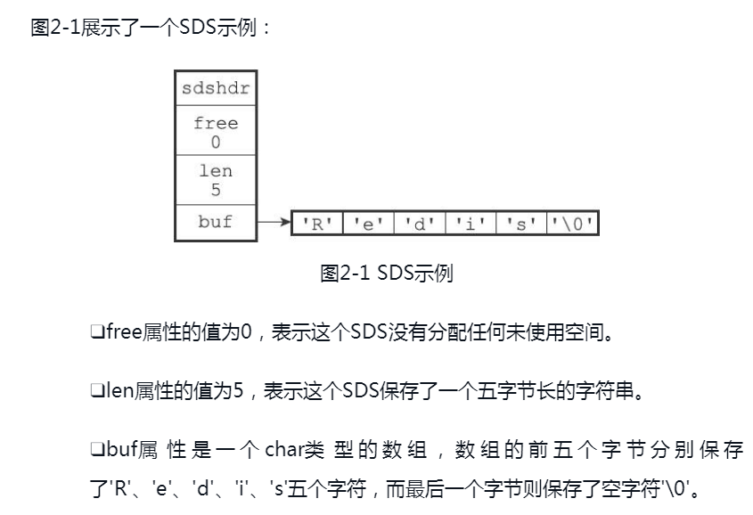

#### 1、SDS的数据结构与示例

​		Redis 是用 C 语言开发的一个高性能缓存框架，支持五种基本的数据结构，这些数据结构的底层也是由 C 语言实现的。

​		简单动态字符串（Simple Dynamic String），简称 SDS，其底层实现如下所示。

```c
struct sdshdr {
    int len;     //记录buf数组已使用字节数量，即字符串长度
    int free;    //记录buf数组未使用字节数量，即剩余空间
    char buf[];  //字节数组，用于保存字符串
}
```



<div align="center" style="font-size:12px">图1-1 SDS数据结构示例图</div>

#### 2、SDS跟C字符串的区别（优势）
##### （1）常数复杂度获取字符串长度
​		C字符串获取长度时，需要遍历整个字符串，其时间复杂度为O(N)

​		SDS则本身len属性记录了长度，获取长度的时间复杂度仅为O(1)
##### （2）杜绝缓存区溢出
​		C字符串如果在追加字符前未给该字符串分配足够多的内存空间，那么该字符串的数据可能会溢出、污染到相邻空间的内存数据。

| str 1 |  str 2  |
| :---: | :-----: |
| Redis | MongoDB |


| str 1 | str 2   |
| :---: | :-----: |
| Redis | Cluster |

​		例如 str1 和 str2 在内存中是紧挨着的，然后 str1 使用 strcat 方法追加内容"Cluster"，那么 str1 的数据将溢出到 str2 的内存空间里，在 str2 不知情的情况下将"MongoDB"修改成了"Cluster"，这是 **C 语言的缓冲区溢出问题，即 API 的调用是不安全的**。


​		SDS 则没有该问题的存在，在对字符串进行拼接操作时，它会先检查字符串的长度是否足够，即 free 的空间是否足够，若不足则会先扩展空间再进行拼接操作
##### （3）减少修改字符串时的内存重分配次数

​		C 字符串在进行**增长字符串**操作时，若没在操作前通过内存重分配来**扩展空间**，那就有可能产生**缓冲区溢出**的问题。

​		C 字符串在进行**缩短字符串**操作时，若没在操作前通过内存重分配来**释放空间**，那就有可能产生**内存泄漏**的问题。


​		Redis 当然不可能每次操作都进行内存重分配，那样会相当影响性能，于是 SDS 使用空间预分配和惰性空间释放两种策略来进行优化。


- 内存预分配


  - 当 SDS 修改后的长度（即 len 属性值）小于 1M 时，程序除了为其分配修改后的长度的内存空间，还会为其分配同等长度的未使用空间。

    例如，若 SDS 的 len 修改后变成 13 字节，那么程序会为其分配 13 字节的未使用空间，最终 buf 数组的长度为 13 + 13 + 1 = 27 字节

  - 当 SDS 修改后的长度（即 len 属性值）大于 1M 时，程序除了分配应有的空间外，还会为其分配 1M 的未使用空间。

    例如，若 SDS 的 len 修改后变成 30M，那么程序会分配 1M 的未使用空间，最终 buf 数组的长度为 30M + 1M + 1 byte

- 惰性空间释放

  定义：当 SDS 的 API 需要缩短字符串时，程序不会立即用内存重分配去回收空间，而是用 free 属性将这部分长度记录起来，等待再次使用。

  优点：这样做能避免缩短字符串带来的内存重分配操作，并为之后可能有的增长操作提供优化。

  ​			同时，SDS 也提供了相应的 API 可以在有需要时释放 SDS 的未使用空间，所以不必担心惰性空间策略的内存浪费问题。


#### 3、二进制安全	

- C 字符串中的字符必须符合某种编码（例如 ASCII ），并且除末尾外中间不能包含空字符，C 字符串只能用来保存文本数据。

- Redis 的 SDS 不仅可以保存文本数据，还可以保存任意格式的二进制数据，例如图片、音频、视频、压缩文件等

  Redis 的 SDS API 采用了二进制的处理方式将数据保存到 buf 数组中，buf 数组保存的不是字符，而是一系列二进制数据，因此它也被称作**字节数组**。

##### 4、兼容部分C字符串函数	

​		虽然 SDS 的 API 都是二进制安全的，但它们同样遵循着 C 字符串以空字符结尾的惯例，这是为了让 SDS 可以重用一部分 <string.h> 函数，避免重复造轮子。